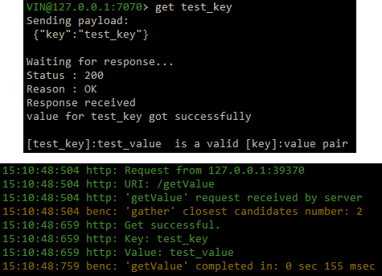
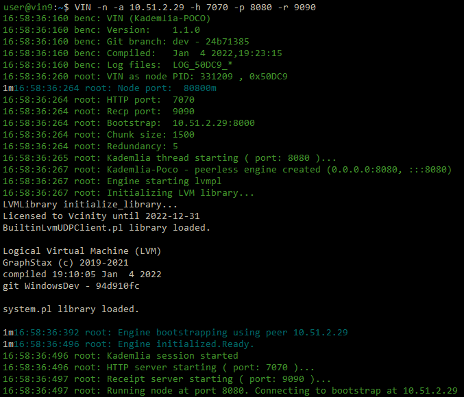
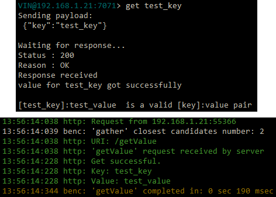

**************************************
Installing and using the VIN™
**************************************

Introduction
============

The sections below contain instructions for installing the *VIN™* for both *Windows* and *Linux* operating systems. Furthermore, setting up the  *VIN™* and running *VIN™* commands using the *VIN™ CLI* (refer to :doc:`vin_cli` for more information) are detailed.

Installation
============

Linux (Ubuntu 20.04+)
----------------------
  
* Navigate to the folder containing the ``DEB`` file on the system.  
* ``sudo dpkg -i QToken-CPP_1.12.3-x86_64.deb``

If installing the *VIN™* on a system with a previous installation, ``dpkg`` may produce errors regarding overwriting files. Make a backup of those files and then run the following command to do the upgrade:

* ``sudo dpkg -i --force-overwrite QToken-CPP_1.12.3-x86_64.deb``

To ensure the *VIN™* is directed to the required libraries run:

* ``echo "export LD_LIBRARY_PATH=/usr/local/lib:/usr/lib" > ~/.profile``
* ``export LD_LIBRARY_PATH=/usr/local/lib:/usr/lib`` 

Windows
----------

* Navigate to the folder containing the ``VIN.zip`` file on the system
* Run ``tar -xf VIN.zip`` from a CLI session (as an administrator) or double click the file and follow the prompts to extract the contents 
* Navigate to the extracted folder and run ``msiexec /i VIN.msi`` from a CLI session (as an administrator) or double click the file and follow the prompts to install the *VIN™*  
  

Components
----------

* *VIN™ Command Line Interface (CLI)*: the *VIN™ CLI* acts as a Hypertext Transfer Protocol (HTTP) client for reaching the *VIN™* HTTP server from the command line in a *Linux* environment. 
* ``defaults.cfg``: a modifiable configuration file located in the ``/etc/opt/VIN/`` directory for *Linux* and under ``Program Files\Virgil\VIN`` for *Windows*. For more information on the configuration, refer to the :doc:`configuration` section.
  

Disk
====

All *VIN™* Disk IO occurs and is located in ``/opt/VIN`` for *Linux* based operating systems and ``Program Files\Virgil\VIN\`` for *Windows*. Any cryptographic receipts and reconstructed data will be stored here.

Debug Logs
==========

*VIN™* nodes store log outputs in ``/var/log/VIN/logs/`` for *Linux* based operating systems and ``Program Files\Virgil\VIN\logs\`` for *Windows*. If any support from Virgil Systems is required, these logs can be sent along with any support requests to obtain more visibility into the issue.

Running the *VIN™* 
====================

Currently there are two ways in setting up the *VIN™*: on the same host system or through a local network. Both require very similar setups but differ in the way that peers are configured. The method for instantiating the *VIN™* for both cases and a example to demonstrate the *VIN™'s* share function are described below. Futhermore, flags to control the functionality of the *VIN™ CLI* commands are listed in the following table:

.. This information came from C:\Dev\qtoken-cpp\apps\helper.cpp 

.. csv-table:: VIN™ Command Flags
    :header: Flag Name, Command Line Instruction, Description
    :widths: 20 10 70 

    List Flag, -l, "Displays a list out all *VIN™* flags along with their descriptions."
    Bootstrap Flag, -b, "Indicates that the node being instantiated will be a bootstrap node."
    Node Flag, -n, "Indicates that the node being instantiated will be a peer node."
    Configuration Directory Flag, -c, "Specify the location of a configuration file to start with."
    Bootstrap IP Flag, -a, "This flag specifies that the next string will be the bootstrap node's IP address which the peer will connect to."
    Bootstrap Port Flag, -s, "Specify a custom bootstrap port."
    Kademlia Port Flag, -p, "This flag specifies that the next string will be the Kademlia port through which the node will communicate bi-directionally with the Kademlia network."
    Receipt Port Flag, -r, "This flag specifies that the next string will be the port through which the node will receive its cryptographic receipts."
    HTTP Port Flag, -h, "This flag specifies that the next string will be the port utilized for HTTP messages by the node."
    LVM Port Flag, -v, "This flag specifies that the next string will be the port through which the node communicates with the *LVM*."

Running the *VIN™* on a *Linux* Operating System
================================================

There are two ways in setting up the *VIN™*: on the same host system and through a local network. Both require very similar setups but differ in the way that peers are configured. The method for instantiating the *VIN™* for both cases and a example to demonstrate the *VIN™'s* ``put``, ``get``, ``spread``, ``gather``, ``share``, ``getPeers``, and ``shutdown`` functionality are described in the following sections. Note: The logs of all the *VIN™* transactions are located in ``/var/log/VIN/logs/``. The examples were completed on virtual machines connected to a system running *Ubuntu*, while *ConEmu* was utilized to run the command line interfaces. If any issues occur while setting up the *VIN™* or while running any *VIN™ CLI* commands, refer to the :ref:`tips-troubleshooting` section for assistance.

A Single Host System (Linux)
----------------------------

Setting up the System - Single Host (*Linux*)
^^^^^^^^^^^^^^^^^^^^^^^^^^^^^^^^^^^^^^^^^^^^^

To run a simple *VIN™* on a local machine, a minimum of three *VIN™* nodes, one bootstrap node and two sender/receiver peer nodes, must be instantiated. Additionally, to perform commands with the network, the *VIN™ Command Line Interface* (*VIN™ CLI*) must be started. To do so, the following steps should be completed:

* Upon installation of the *VIN™*, *VIN™* nodes can be launched from any directory using commands in a command line interface (CLI). 
* Begin by opening four CLI sessions.
* In one of the sessions, run ``VIN -b 127.0.0.1``. This will serve as the bootstrap node with the IP address of the host (``127.0.0.1``) and will occupy port ``8000`` for incoming connections. Note: ``VIN -b`` will also work.

.. figure:: images/getting_started_with_vin/linux/bootstrap_connected_host.png
  :scale: 100
  :align: center
  :alt: Bootstrap Connected Successfully on Host

  Bootstrap Connected Successfully

* In another session, run ``VIN -n -a 127.0.0.1 -h 7070 -p 8080 -r 9090``. This will start a *VIN™* peer node and connect it to the bootstrap which has an IP address of ``127.0.0.1``. The peer node starts with an HTTP port of ``7070``, a data (Kademlia) port of ``8080`` and a receipt server port of ``9090``. These ports can be chosen based on the requirements/restrictions of the user.

.. figure:: images/getting_started_with_vin/linux/peer_connected_host.png
  :scale: 100
  :align: center
  :alt: Peer Connected Successfully on Host

  Peer Connected Successfully

* On the third session run ``VIN -n -a 127.0.0.1 -h 7071 -p 8081 -r 9091``. Note that the HTTP, data and receipt ports are different than the node which was first instantiated.
* On the final session run ``VIN_CLI 127.0.0.1 7070``. This will successfully launch the *VIN™ CLI* and connect it to the peer with an HTTP port of ``7070``. If everything is working correctly, the CLI window should contain the following:

.. figure:: images/getting_started_with_vin/linux/vincli_connected_host.png
  :scale: 100
  :align: center
  :alt: VIN™ CLI Connected Successfully on Host

  *VIN™ CLI* Connected Successfully

Network Interaction - Single Host (*Linux*)
^^^^^^^^^^^^^^^^^^^^^^^^^^^^^^^^^^^^^^^^^^^

Putting and Getting A Key-Value Pair
""""""""""""""""""""""""""""""""""""

The following will showcase how to a put key-value pair onto the network as a simple test to ensure the functionality of the *VIN™*. 

* To put a key-value onto the network, in the *VIN™ CLI* session run ``put <key> <value>``; where ``<key>`` and ``<value>`` can be any string that does not contain spaces. For this example ``test_key`` was used for the ``<key>`` and ``test_value`` for the ``<value>``. The following figure displays the result of running this command; where the top image is the output from the *VIN™ CLI* and the bottom is from the peer.

  Successful Put (*VIN™ CLI* = top, Peer = bottom)

* To view the shard that was placed on the *Kademlia* network, navigate to ``/opt/VIN/kademlia/data/`` and proceed through the folder structure until reaching the file.
* To get a value from the network, in the *VIN™ CLI* session run ``get <key>``; where ``<key>`` is ``test_key`` for this example. The following figure displays the result of running this command; where the top image is the output from the *VIN™ CLI* and the bottom is from the peer.

  Successful Get (*VIN™ CLI* = top, Peer = bottom)

Spreading and Gathering a File
""""""""""""""""""""""""""""""

The *VIN™* can spread any file type onto it's network. To do a ``spread``, perform the following:

* In the *VIN™ CLI* session run ``spread <filepath>``; where the ``<filepath>`` is the absolute path and name of the file to be spread. For this example, it is ``/home/user/Dev/test/vin_test.txt``. An encrypted cryptographic receipt is generated upon spreading and is stored in ``/opt/VIN/receipts/sent`` and the encrypted data is placed onto the *Kademlia* network and can be seen in ``/opt/VIN/kademlia/data/``. Additionally, the data, broken into shards, is viewable in ``/var/log/VIN/shards/``. Note: the number of shards is dependant on the size of the file and the parameters set in the ``chunker`` object, which is set in ``defaults.cfg`` (see :ref:`configuration` for more details).
* The output of a successful ``spread`` is shown below.

  Successful Spread (*VIN™ CLI* = top, Peer = bottom)

* After a file as been spread to the network a cryptographic receipt will be generated. Using this receipt, the file can be retrieved from the network via the ``gather`` command. To do a basic ``gather``, in the *VIN™ CLI* session run ``gather <receipt_path>``. The ``<receipt_path>`` will be shown in the *VIN™ CLI* session and, for this example, is ``/opt/VIN/receipts/sent/CR3053327074``. If the file was successfully gathered, the following output should be displayed.

  Successful Gather (*VIN™ CLI* = top, Peer = bottom)

* To inspect the gathered file, navigate to ``/opt/VIN/outputs`` and enter ``ls``. A folder with the name of the file which was shared should be listed. Enter this folder (``cd <folder_name>``) and run ``ls``. The file which was shared will be displayed and can be inspected to ensure it was successfully shared. 
* Note: the ``gather`` command, by default, will create a new file on the system after it finishes; thus, the gathered file may have a number appended to end of the filename. For more information on how to overwrite the file, or append to its contents, refer to the :ref:`supported-commands` table.

Sharing a File
""""""""""""""

The following will describe how to share files between the peers on the same host system.

* In the *VIN™ CLI* session, the following command should be run after the required information is determined: ``share <filepath> <ip_address> <receipt_port>``. ``<filepath>`` is the absolute path and filename of the file to be shared, for example, in this case it is ``/home/user/Dev/test/vin_test.txt``. Note: any file type can be shared. The ``<ip_address>`` and ``<receipt_port>`` are ``127.0.0.1`` and ``9091``, or the IP address of the host system and the ``receipt_port`` of the second peer running on it.
* Thus, the command to run, for this example, becomes ``share /home/user/Dev/test/vin_test.txt 127.0.0.1 9091``. If everything worked correctly, the following should be displayed on the CLI sessions. 

  Successful Share Between Peers (*VIN™ CLI* = top, Peer_1 = left, Peer_2 = right)

* To manually confirm that the file was shared correctly, enter ``ls`` in the CLI session pointing to the ``/opt/VIN/outputs`` folder directory. A folder with the name of the file which was shared should be listed. Enter this folder (``cd <folder_name>``) and run ``ls``. The file which was shared will be displayed and can be inspected to ensure it was successfully shared.
* Additionally, the cryptographic receipt for the share is stored in ``/opt/VIN/receipts/sent``, the encrypted data can be seen in ``/opt/VIN/kademlia/data/``, and the sharded data is viewable in ``/var/log/VIN/shards/``. Note: the number of shards is dependant on the size of the file and the parameters set in the ``chunker`` object, which is set in ``defaults.cfg`` (see :ref:`configuration` for more details).

Getting Peers Connected to the Bootstrap
""""""""""""""""""""""""""""""""""""""""

In the *VIN™ CLI* session run ``getPeers`` to generate a list of all peers connected to a bootstrap node. The result will be an output similar to the one displayed in the figure below.  

  GetPeers Result

For this example, there are two peers with their information listed as follows: ``[unique_node_identifier: { ip_address_of_peers_host peers_data_port }]``

Shutting Down the Network
"""""""""""""""""""""""""

* Press **ctrl + c** while the bootstrap node's CLI session is active to kill the process.
* To shutdown a peer node which is connected to the *VIN™ CLI*, run ``shutdown`` in the *VIN™ CLI* session connected to the peer. Alternatively, press **ctrl + c** while the peer node's CLI session is active to kill the process.
* To exit from the *VIN™ CLI*, type **exit** and hit **Enter** in the *VIN™ CLI* session. Alternatively, press **ctrl + c** while theCLI session containing the *VIN™ CLI* is active to kill the process.

.. _local-network:

A Local Network (*Linux*)
-------------------------

Setting up the Systems - Local Network (*Linux*)
^^^^^^^^^^^^^^^^^^^^^^^^^^^^^^^^^^^^^^^^^^^^^^^^

To run a basic *VIN™* on an IP based network, such as *Amazon Web Services (AWS)*, a Local Area Network (LAN) with routers/switches and Dynamic Host Communication Protocol (DHCP), *VMware*, etc., complete the following steps:

* For this example, two systems will be used: ``system_1`` and ``system_2``.
* Complete the *VIN™* installation procedure on each system.
* On each system, open three CLI sessions. 
* Since each system will have it's own IP address, deemed ``<ip_1>`` and ``<ip_2>`` for this example, it is imperative to determine and record it.
* Run ``ifconfig`` in one of the CLI sessions. Note: if this feature is not installed a message will appear recommending that ``sudo install net-tools`` be run. If this is the case, run this command and re-run ``ifconfig`` to generate an output similar to the one below. 
  
.. figure:: images/getting_started_with_vin/linux/ifconfig_results.png
  :scale: 100
  :align: center
  :alt: ifconfig results

  ifconfig Results
  
* Record the address next to the ``inet`` parameter for the required network connection (i.e., wired or wireless). In the image, the ``inet`` corresponding to an ethernet connection, ``eth0``, was recorded as ``<ip_1>``.
* Repeat the above instructions for ``system_2`` and record ``<ip_2>``.
* In one of the three sessions on ``system_1``, run ``VIN -b <ip_1>`` (``VIN -b`` will also work). For this example, ``<ip_1>`` is ``10.51.2.29``. This will serve as the bootstrap node and will occupy port ``8000`` for incoming connections. If the bootstrap was successfully launched, the CLI session will output similar results to those in the following figure.

.. figure:: images/getting_started_with_vin/linux/bootstrap_connected_local.png
  :scale: 100
  :align: center
  :alt: Bootstrap Connected Successfully on Host

  Bootstrap Connected Successfully

* In another session on ``system_1``, run ``VIN -n -a <ip_1> -h 7070 -p 8080 -r 9090``. This will start a *VIN™* peer node with an HTTP port of ``7080``, a data (*Kademlia*) port of ``8080`` and a receipt server port of ``9090`` and connect to the bootstrap on ``<ip_1>``. Note: these ports can be chosen based on the requirements/restrictions of the user. 
* If the peer connects to the bootstrap successfully the session will contain a similar output to the one in the figure below. Take note that it displays the ports and IP address that was used during the peer's instantiation.

  Peer Connected Successfully

* In the third session on ``system_1``, run ``VIN_CLI <ip_1> 7070``. This will launch the *VIN™ CLI* if the above steps were completed successfully. If everything is working correctly, the CLI session should contain the following:

.. figure:: images/getting_started_with_vin/linux/vincli_connected_local.png
  :scale: 100
  :align: center
  :alt: VIN™ CLI Connected Successfully

  *VIN™ CLI* Connected Successfully

* In a session on ``system_2``, run ``VIN -n -a <ip_1> -h 7071 -p 8081 -r 9091``, where ``<ip_1>`` is ``10.51.2.29`` for this example. This will connect to the bootstrap located on ``system_1`` with its IP address of ``<ip_1>``.
* In the second session, run ``VIN_CLI <ip_2> 7071`` to connect to the peer on ``system_2`` using ``<ip_2>`` (or ``10.51.2.30`` for this example).  
* In the final session, navigate to  ``/opt/VIN/outputs``. This directory will contain the received file after it has been reconstructed during the example in the following section. 

Network Interaction - Local Network (*Linux*)
^^^^^^^^^^^^^^^^^^^^^^^^^^^^^^^^^^^^^^^^^^^^^^

With *VIN™* peers successfully running on both systems, a number of commands can be entered to interact with the instantiated network and between the peers themselves. The following examples will highlight the use of the ``put``, ``get``, ``share``, ``getPeers`` and ``shutdown`` commands with the *VIN™ CLI*. Note: ``spread`` and ``gather`` are not shown for a local network as the cryptographic receipt generated by ``spread``, which is required by ``gather``, is stored on the system that performed the ``spread``. While manually copying the file to the other system and then running ``gather`` is feasible, testing ``spread`` and ``gather`` is best done on a single host network. For a full list of the *VIN™ CLI's* functionality refer to :doc:`vin_cli`. Additionally, refer to :doc:`configuration` for more information regarding locations of files generated while using the *VIN™ CLI*.

Putting and Getting A Key-Value Pair
""""""""""""""""""""""""""""""""""""

The following will showcase how to a put key-value pair onto the network as a simple test to ensure the functionality of the *VIN™*. While the *VIN™ CLI* connected to the peer on ``system_1`` will be utilized for the ``put``, any peer/*VIN™ CLI* connection has this capability. 

* To put a key-value onto the network, in the *VIN™ CLI* session on ``system_1``, run ``put <key> <value>``; where ``<key>`` and ``<value>`` can be any string that does not contain spaces. For this example ``test_key`` was used for the ``<key>`` and ``test_value`` for the ``<value>``. The following figure displays the result of running this command; where the top image is the output from the *VIN™ CLI* and the bottom is from the peer.

.. figure:: images/getting_started_with_vin/linux/put_vincli_peer_local.png
  :scale: 100
  :align: center
  :alt: Successful Put

  Successful Put (*VIN™ CLI* = top, Peer_1 = bottom)

* To view the shard that was placed on the *Kademlia* network, navigate to ``/opt/VIN/kademlia/data/`` and proceed through the folder structure until reaching the file.
* To get a value from the network, in the *VIN™ CLI* session on ``system_2``, run ``get <key>``; where ``<key>`` is ``test_key`` for this example. The following figure displays the result of running this command; where the top image is the output from the *VIN™ CLI* and the bottom is from the peer.

.. figure:: images/getting_started_with_vin/linux/get_vincli_peer_local.png
  :scale: 100
  :align: center
  :alt: Successful Get

  Successful Get (*VIN™ CLI* = top, Peer_2 = bottom)

Sharing a File
""""""""""""""

The following will describe how to share files between the peer on ``system_1`` to the peer located on ``system_2``. Note: the peer/*VIN™ CLI* connection on ``system_2`` could also be used to perform the share.

* In the *VIN™ CLI* session on ``system_1``, the following command should be run after the required information is determined: ``share <filepath> <ip_address> <receipt_port>``. ``<filepath>`` is the absolute path and filename of the file to be shared, for example, in this case it is ``/home/user/Dev/test/vin_test.txt``. Note: any file type can be shared. The ``<ip_address>`` and ``<receipt_port>`` are ``<ip_2>`` (or ``10.51.2.30`` for this example) and ``9091``, or the IP address of ``system_2`` and the ``receipt_port`` of the peer running on it.
* Thus, the command to run, for this example, becomes ``share /home/user/Dev/test/vin_test.txt 10.51.2.30 9091``. If everything worked correctly, the following should be displayed on ``system_1`` and ``system_2``. 

  Successful Share Between Peers (*VIN™ CLI* = top, Peer_1 = left, Peer_2 = right)

* To manually confirm that the file was shared correctly, enter ``ls`` in the CLI session on ``system_2`` pointing to the ``/opt/VIN/outputs`` folder directory. A folder with the name of the file which was shared should be listed. Enter this folder (``cd <folder_name>``) and run ``ls``. The file which was shared will be displayed and can be inspected to ensure it was successfully shared.
* Additionally, the cryptographic receipt for the share is stored in ``/opt/VIN/receipts/sent``, the encrypted data can be seen in ``/opt/VIN/kademlia/data/``, and the sharded data is viewable in ``/var/log/VIN/shards/``. Note: the number of shards is dependant on the size of the file and the parameters set in the ``chunker`` object, which is set in ``defaults.cfg`` (see :ref:`configuration` for more details).

Getting Peers Connected to the Bootstrap
""""""""""""""""""""""""""""""""""""""""

In the *VIN™ CLI* session on ``system_1``, run ``getPeers`` to generate a list of all peers connected to a bootstrap node. The result will be an output similar to the one displayed in the figure below.  

.. figure:: images/getting_started_with_vin/linux/getpeers_local.png
  :scale: 100
  :align: center
  :alt: GetPeers Result

  GetPeers Result

For this example, there are two peers with their information listed as follows: ``[unique_node_identifier: { ip_address_of_peers_host peers_data_port }]``

Shutting Down the Network
"""""""""""""""""""""""""

* Press **ctrl + c** while the bootstrap node's CLI session is active to kill the process.
* To shutdown a peer node which is connected to the *VIN™ CLI*, run ``shutdown`` in the *VIN™ CLI* session connected to the peer. Alternatively, press **ctrl + c** while the peer node's CLI session is active to kill the process.
* To exit from the *VIN™ CLI*, type **exit** and hit **Enter** in the *VIN™ CLI* session. Alternatively, press **ctrl + c** while theCLI session containing the *VIN™ CLI* is active to kill the process.

================================================================================

Running the *VIN™* on a *Windows* Operating System
==================================================

There are two ways in setting up the *VIN™*: on the same host system and through a local network. Both require very similar setups but differ in the way that peers are configured. The method for instantiating the *VIN™* for both cases and a example to demonstrate the *VIN™'s* ``put``, ``get``, ``spread``, ``gather``, ``share``, ``getPeers``, and ``shutdown`` functionality are described in the following sections. Note: The logs of all the *VIN™* transactions are located in ``C:\ProgramData\VIN\logs\``. The examples were completed on virtual machines connected on systems running *Windows 10*, while *ConEmu* was utilized to run the *PowerShell* command line interfaces. If any issues occur while setting up the *VIN™* or while running any *VIN™ CLI* commands, refer to the :ref:`tips-troubleshooting` section for assistance.

A Single Host System (*Windows*)
--------------------------------

Setting up the System - Single Host (*Windows*)
^^^^^^^^^^^^^^^^^^^^^^^^^^^^^^^^^^^^^^^^^^^^^^^^

To run a simple *VIN™* on a local machine, a minimum of three *VIN™* nodes, one bootstrap node and two sender/receiver peer nodes, must be instantiated. Additionally, to perform commands with the network, the *VIN™ Command Line Interface* (*VIN™ CLI*) must be started. To do so, the following steps should be completed:

* Upon installation of the *VIN™*, *VIN™* nodes can be launched from any directory using commands in a command line interface (CLI). 
* Begin by opening four CLI sessions.
* In one of the sessions, run ``VIN -app -b 127.0.0.1``. This will serve as the bootstrap node with the IP address of the host (``127.0.0.1``) and will occupy port ``8000`` for incoming connections. Note: ``VIN -app -b`` will also work.

.. figure:: images/getting_started_with_vin/windows/bootstrap_connected_host.png
  :scale: 100
  :align: center
  :alt: Bootstrap Connected Successfully on Host

  Bootstrap Connected Successfully

* In another session, run ``VIN -app -n -a 127.0.0.1 -h 7070 -p 8080 -r 9090``. This will start a *VIN™* peer node and connect it to the bootstrap which has an IP address of ``127.0.0.1``. The peer node starts with an HTTP port of ``7070``, a data (Kademlia) port of ``8080`` and a receipt server port of ``9090``. These ports can be chosen based on the requirements/restrictions of the user.

  Peer Connected Successfully

* On the third session run ``VIN -app -n -a 127.0.0.1 -h 7071 -p 8081 -r 9091``. Note that the HTTP, data and receipt ports are different than the node which was first instantiated.
* On the final session run ``VIN_CLI 127.0.0.1 7070``. This will successfully launch the *VIN™ CLI* and connect it to the peer with an HTTP port of ``7070``. If everything is working correctly, the CLI window should contain the following:

  *VIN™ CLI* Connected Successfully

With the simple, two-peer network established and the *VIN™ CLI* connected, transmission between the two peers and the network is now possible. To get started using the *VIN™* and for details on the commands available to the *VIN™ CLI*, including examples of each, refer to :doc:`vin_cli`. Note: the :doc:`vin_cli` section and it's examples correspond with the single host network. For setting up and using a multi-host network, see the section below.

Network Interaction - Single Host (*Windows*)
^^^^^^^^^^^^^^^^^^^^^^^^^^^^^^^^^^^^^^^^^^^^^^

Putting and Getting A Key-Value Pair
""""""""""""""""""""""""""""""""""""

The following will showcase how to a put key-value pair onto the network as a simple test to ensure the functionality of the *VIN™*. 

* To put a key-value onto the network, in the *VIN™ CLI* session run ``put <key> <value>``; where ``<key>`` and ``<value>`` can be any string that does not contain spaces. For this example ``test_key`` was used for the ``<key>`` and ``test_value`` for the ``<value>``. The following figure displays the result of running this command; where the top image is the output from the *VIN™ CLI* and the bottom is from the peer.

  Successful Put (*VIN™ CLI* = top, Peer = bottom)

* To view the shard that was placed on the *Kademlia* network, navigate to ``C:\ProgramData\VIN\kademlia\data`` and proceed through the folder structure until reaching the file.
* To get a value from the network, in the *VIN™ CLI* session run ``get <key>``; where ``<key>`` is ``test_key`` for this example. The following figure displays the result of running this command; where the top image is the output from the *VIN™ CLI* and the bottom is from the peer.

  Successful Get (*VIN™ CLI* = top, Peer = bottom)

Spreading and Gathering a File
""""""""""""""""""""""""""""""

The *VIN™* can spread any file type onto it's network. To do a ``spread``, perform the following:

* In the *VIN™ CLI* session run ``spread <filepath>``; where the ``<filepath>`` is the absolute path and name of the file to be spread. For this example, it is ``C:\Dev\test\vin_test.txt``. An encrypted cryptographic receipt is generated upon spreading and is stored in ``C:\ProgramData\VIN\receipts\sent\`` and the encrypted data is placed onto the *Kademlia* network and can be seen in ``C:\ProgramData\VIN\kademlia\data``. Additionally, the data, broken into shards, is viewable in ``C:\ProgramData\VIN\shards\``. Note: the number of shards is dependant on the size of the file and the parameters set in the ``chunker`` object, which is set in ``defaults.cfg`` (see :ref:`configuration` for more details).
* The output of a successful ``spread`` is shown below.

  Successful Spread (*VIN™ CLI* = top, Peer = bottom)

* After a file as been spread to the network a cryptographic receipt will be generated. Using this receipt, the file can be retrieved from the network via the ``gather`` command. To do a basic ``gather``, in the *VIN™ CLI* session run ``gather <receipt_path>``. The ``<receipt_path>`` will be shown in the *VIN™ CLI* session and, for this example, is ``C:\ProgramData\VIN\receipts\sent\CR3066281403``. If the file was successfully gathered, the following output should be displayed.

  Successful Gather (*VIN™ CLI* = top, Peer = bottom)

* To inspect the gathered file, navigate to ``/opt/VIN/outputs`` and enter ``ls``. A folder with the name of the file which was shared should be listed. Enter this folder (``cd <folder_name>``) and run ``ls``. The file which was shared will be displayed and can be inspected to ensure it was successfully shared. 
* Note: the ``gather`` command, by default, will create a new file on the system after it finishes; thus, the gathered file may have a number appended to end of the filename. For more information on how to overwrite the file, or append to its contents, refer to the :ref:`supported-commands` table.

Sharing a File
""""""""""""""

The following will describe how to share files between the peers on the same host system.

* In the *VIN™ CLI* session, the following command should be run after the required information is determined: ``share <filepath> <ip_address> <receipt_port>``. ``<filepath>`` is the absolute path and filename of the file to be shared, for example, in this case it is ``C:\Dev\test\vin_test.txt``. Note: any file type can be shared. The ``<ip_address>`` and ``<receipt_port>`` are ``127.0.0.1`` and ``9091``, or the IP address of the host system and the ``receipt_port`` of the second peer running on it.
* Thus, the command to run, for this example, becomes ``share C:\Dev\test\vin_test.txt 127.0.0.1 9091``. If everything worked correctly, the following should be displayed on the CLI sessions. 

  Successful Share Between Peers (*VIN™ CLI* = top, Peer_1 = left, Peer_2 = right)

* To manually confirm that the file was shared correctly, enter ``ls`` in the CLI session pointing to the ``/opt/VIN/outputs`` folder directory. A folder with the name of the file which was shared should be listed. Enter this folder (``cd <folder_name>``) and run ``ls``. The file which was shared will be displayed and can be inspected to ensure it was successfully shared.
* Additionally, the cryptographic receipt for the share is stored in ``C:\ProgramData\VIN\receipts\sent\``, the encrypted data can be seen in ``C:\ProgramData\VIN\kademlia\data``, and the sharded data is viewable in ``C:\ProgramData\VIN\shards\``. Note: the number of shards is dependant on the size of the file and the parameters set in the ``chunker`` object, which is set in ``defaults.cfg`` (see :ref:`configuration` for more details).

Getting Peers Connected to the Bootstrap
""""""""""""""""""""""""""""""""""""""""

In the *VIN™ CLI* session run ``getPeers`` to generate a list of all peers connected to a bootstrap node. The result will be an output similar to the one displayed in the figure below.  

  GetPeers Result

For this example, there are two peers with their information listed as follows: ``[unique_node_identifier: { ip_address_of_peers_host peers_data_port }]``

Shutting Down the Network
"""""""""""""""""""""""""

* Press **ctrl + c** while the bootstrap node's CLI session is active to kill the process.
* To shutdown a peer node which is connected to the *VIN™ CLI*, run ``shutdown`` in the *VIN™ CLI* session connected to the peer. Alternatively, press **ctrl + c** while the peer node's CLI session is active to kill the process.
* To exit from the *VIN™ CLI*, type **exit** and hit **Enter** in the *VIN™ CLI* session. Alternatively, press **ctrl + c** while theCLI session containing the *VIN™ CLI* is active to kill the process.

A Local Network (*Windows*)
---------------------------

Setting up the Systems - Local Network (*Windows*)
^^^^^^^^^^^^^^^^^^^^^^^^^^^^^^^^^^^^^^^^^^^^^^^^^^

To run a basic *VIN™* on an IP based network, such as *Amazon Web Services (AWS)*, a Local Area Network (LAN) with routers/switches and Dynamic Host Communication Protocol (DHCP), *VMware*, etc., complete the following steps:

* For this example, two systems will be used: ``system_1`` and ``system_2``.
* Complete the *VIN™* installation procedure on each system.
* On each system, open three CLI sessions. 
* Since each system will have it's own IP address, deemed ``<ip_1>`` and ``<ip_2>`` for this example, it is imperative to determine and record it.

* Run ``ipconfig`` in one of the sessions to generate an output similar to the one below.

  ipconfig Results

* Record the address next to the ``IPv4 Address`` parameter for the required network connection (i.e., wired or wireless). In the image, the ``IPv4 Address`` corresponding to a wireless connection, ``Wireless LAN adapter Wi-Fi``, was recorded as ``<ip_1>``.
* Repeat the above instructions for ``system_2`` and record ``<ip_2>``.
* In one of the three sessions on ``system_1``, run ``VIN -app -b <ip_1>`` (``VIN -app -b`` will also work). For this example, ``<ip_1>`` is ``192.168.1.20``. This will serve as the bootstrap node and will occupy port ``8000`` for incoming connections. If the bootstrap was successfully launched, the CLI session will output similar results to those in the following figure.

  Bootstrap Connected Successfully

* In another session on ``system_1``, run ``VIN -app -n -a <ip_1> -h 7070 -p 8080 -r 9090``, where ``<ip_1>`` is ``192.168.1.20`` for this example. This will start a *VIN™* peer node with an HTTP port of ``7080``, a data (*Kademlia*) port of ``8080`` and a receipt server port of ``9090`` and connect to the bootstrap on ``<ip_1>``. Note: these ports can be chosen based on the requirements/restrictions of the user. If the peer connects to the bootstrap successfully the session will contain a similar output to the one in the figure below. Take note that it displays the ports and IP address that was used during the peer's instantiation.

  Peer Connected Successfully

* In the third session on ``system_1``, run ``VIN_CLI <ip_1> 7070``, where ``<ip_1>`` is ``192.168.1.20`` for this example. This will launch the *VIN™ CLI* if the above steps were completed successfully. If everything is working correctly, the CLI session should contain the following:

.. figure:: images/getting_started_with_vin/windows/vincli_connected_local.png
  :scale: 100
  :align: center
  :alt: VIN™ CLI Connected Successfully

  *VIN™ CLI* Connected Successfully

* In a session on ``system_2``, run ``VIN -app -n -a <ip_1> -h 7071 -p 8081 -r 9091``. This will connect to the bootstrap located on ``system_1`` with its IP address of ``<ip_1>``.
* In the second session, run ``VIN_CLI <ip_2> 7071`` to connect to the peer on ``system_2`` using ``<ip_2>`` (or ``192.168.1.21`` for this example).  
* In the final session, navigate to ``Program Files\Virgil\VIN\outputs``. These directories will contain the received file after it has been reconstructed during the example in the following section. 

Network Interaction - Local Network (*Windows*)
^^^^^^^^^^^^^^^^^^^^^^^^^^^^^^^^^^^^^^^^^^^^^^^^

With *VIN™* peers successfully running on both systems, a number of commands can be entered to interact with the instantiated network and between the peers themselves. The following examples will highlight the use of the ``put``, ``get``, ``share``, ``getPeers`` and ``shutdown`` commands with the *VIN™ CLI*. Note: ``spread`` and ``gather`` are not shown for a local network as the cryptographic receipt generated by ``spread``, which is required by ``gather``, is stored on the system that performed the ``spread``. While manually copying the file to the other system and then running ``gather`` is feasible, testing ``spread`` and ``gather`` is best done on a single host network. For a full list of the *VIN™ CLI's* functionality refer to :doc:`vin_cli`. Additionally, refer to :doc:`configuration` for more information regarding locations of files generated while using the *VIN™ CLI*.

Putting and Getting A Key-Value Pair
""""""""""""""""""""""""""""""""""""

The following will showcase how to put key-value pair onto the network as a simple test to ensure the functionality of the *VIN™*. While the *VIN™ CLI* connected to the peer on ``system_1`` will be utilized for the ``put``, any peer/*VIN™ CLI* connection has this capability. 

* To put a value onto the network, in the *VIN™ CLI* session on ``system_1``, run ``put <key> <value>``; where ``<key>`` and ``<value>`` can be any string without spaces. For this example ``test_key`` was used for the ``<key>`` and ``test_value`` for the ``<value>``. The following figure displays the result of  running this command; where the top image is the output from the *VIN™ CLI* and the bottom is from the peer.

  Successful Put (*VIN™ CLI* = top, Peer_1 = bottom)

* To view the shard that was placed on the *Kademlia* network, navigate to ``C:\ProgramData\VIN\kademlia\data`` and proceed through the folder structure until reaching the file.
* To get a value from the network, in the *VIN™ CLI* session on ``system_2``, run ``get <key>``; where ``<key>`` is ``test_key`` for this example. The following figure displays the result of running this command; where the top image is the output from the *VIN™ CLI* and the bottom is from the peer.

  Successful Get (*VIN™ CLI* = top, Peer_2 = bottom)

Sharing a File
""""""""""""""

The following will describe how to share files between the peer on ``system_1`` to the peer located on ``system_2``. Note: the peer/*VIN™ CLI* connection on ``system_2`` could also be used to perform the share.

* In the *VIN™ CLI* session on ``system_1``, the following command should be run after the required information is determined. ``share <filepath> <ip_address> <receipt_port>``. ``<filepath>`` is the absolute path and filename of the file to be shared, for example, in this case it is ``C:\Dev\test\vin_test.txt``. Note: any file type can be shared. The ``<ip_address>`` and ``<receipt_port>`` are ``<ip_2>`` (or ``192.168.1.21`` for this example) and ``9091``, or the IP address of ``system_2`` and the ``receipt_port`` of the peer running on it.
* Thus, the command to run, for this example, becomes ``share C:\Dev\test\vin_test.txt 192.168.1.21 9091``. If everything worked correctly, the following should be displayed on ``system_1`` and ``system_2``. 

  Successful Share Between Peers (*VIN™ CLI* = top, Peer_1 = left, Peer_2 = right)

* To manually confirm that the file was shared correctly, enter ``ls`` in the CLI session on ``system_2`` pointing to the ``Program Files\Virgil\VIN\outputs`` folder directory. A folder with the name of the file which was shared should be listed. Enter this folder (``cd <folder_name>``) and run ``ls``. The file which was shared will be displayed and can be inspected to ensure it was successfully shared.
* Additionally, the cryptographic receipt for the share is stored in ``C:\ProgramData\VIN\receipts\sent\``, the encrypted data can be seen in ``C:\ProgramData\VIN\kademlia\data``, and the sharded data is viewable in ``C:\ProgramData\VIN\shards\``. Note: the number of shards is dependant on the size of the file and the parameters set in the ``chunker`` object, which is set in ``defaults.cfg`` (see :ref:`configuration` for more details).

Getting Peers Connected to the Bootstrap
""""""""""""""""""""""""""""""""""""""""

In the *VIN™ CLI* session on ``system_1``, run ``getPeers`` to generate a list of all peers connected to a bootstrap node. The result will be an output similar to the one displayed in the figure below.  

.. figure:: images/getting_started_with_vin/windows/getpeers_local.png
  :scale: 100
  :align: center
  :alt: getPeers Example

  getPeers Example

For this example, there are two peers with their information listed as follows: ``[unique_node_identifier: { ip_address_of_peers_host peers_data_port }]``

Shutting Down the Network
"""""""""""""""""""""""""

* Press **ctrl + c** while the bootstrap node's CLI session is active to kill the process.
* To shutdown a peer node which is connected to the *VIN™ CLI*, run ``shutdown`` in the *VIN™ CLI* session connected to the peer. Alternatively, press **ctrl + c** while the peer node's CLI session is active to kill the process.
* To exit from the *VIN™ CLI*, type **exit** and hit **Enter** in the *VIN™ CLI* session. Alternatively, press **ctrl + c** while theCLI session containing the *VIN™ CLI* is active to kill the process.

.. _tips-troubleshooting:

Tips and Troubleshooting
========================

This section details tips for using the *VIN™* as well as highlights troubleshooting for issues that may occur while utilizing the *VIN's™* functionality.

Bootstrap Error During Instantiation
------------------------------------

If a bootstrap node is running and another bootstrap attempts be to instantiated, an error similar to the one in the figure below will appear in the CLI session. Note: though the figure below was captured on a *Linux* OS, a similar error will be present on other operating systems.

  Bootstrap Connection Error

To stop the bootstrap and allow another bootstrap node to run, perform the following based upon the OS in use:

*Linux*
^^^^^^^

* Shutdown all *VIN™* nodes and *VIN™ CLI* sessions
* Open a CLI session and run ``sudo ps -a`` and ensure that at least one ``VIN`` process is running. Note: multiple ``VIN`` processes may be listed if there are *VIN™* peers running.
* Run ``killall VIN`` to stop all of the ``VIN`` processes.

*Windows*
^^^^^^^^^

* Shutdown all *VIN™* nodes and *VIN™ CLI* sessions
* Open a CLI session and run ``tasklist`` and ensure that at least one ``VIN.exe`` process is running. Note: multiple ``VIN`` processes may be listed if there are *VIN™* peers running.
* Run ``taskkill /IM "VIN.exe" /F`` to stop all of the ``VIN.exe`` processes.

I/O error : Permission denied
-----------------------------

If this error is present when attempting to connect a peer to a bootstrap node, it is due to one of the peer's ports being in use by another program on the system. In the image below, the error succeeds the ``HTTP server starting ( port: 7070)`` indicating that port 7070 is in use. 

.. figure:: images/getting_started_with_vin/troubleshooting/io_permission_error.png
  :scale: 100
  :align: center
  :alt: I/O Permission Error

  I/O Permission Error

A solution to the issue is to specify the *VIN™* peer with another HTTP port. Another possibility is to determine which program is using the port in question and to shut it down.