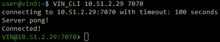

*******************************
Getting Started with the VIN™
*******************************

Introduction
============

* Add links to software that may be required to run the *VIN™* or use its functionality

Installation
============

* System requirements
  
  * Installing dependencies (if there are any)
  

Linux
--------

* *Ubuntu 20.04+*
  
  * Navigate to the folder containing the ``VIN.zip`` file on the system
  * Run ``unzip VIN.zip`` from a command line interface (CLI) session (as an administrator) or double click the file and follow the prompts to extract the contents 
  * Navigate to the extracted folder and run ``VIN.deb`` from a CLI session (as an administrator) or double click the file and follow the prompts to install the *VIN™*  

* *Raspberry Pi*
  
* *CentOS*
  

Windows
----------

* Navigate to the folder containing the ``VIN.zip`` file on the system
* Run ``tar -xf VIN.zip`` from a CLI session (as an administrator) or double click the file and follow the prompts to extract the contents 
* Navigate to the extracted folder and run ``msiexec /i VIN.msi`` from a CLI session (as an administrator) or double click the file and follow the prompts to install the *VIN™*  
  

VMs and Cloud Based Systems
---------------------------

* *Amazon Web Services*

  * Add text...

Android
----------

* Add text...

Other Operating Systems
------------------------

* If integration with an OS that is not listed is required, please contact our team with a request.
	

Components
----------

Any components and modifying files that are installed along with the *VIN™* are listed here.

* *VIN™ Command Line Interface (CLI)*: the *VIN™ CLI* acts as a Hypertext Transfer Protocol (HTTP) client for reaching the *VIN™* HTTP server from the command line in a *Linux* environment. 
* ``defaults.cfg``: a modifiable configuration file located in the ``/etc/opt/VIN/`` directory for *Linux* and under ``Program Files\Virgil\VIN`` for *Windows*. For more information on the configuration, refer to the :doc:`configuration` section.
  
* Third party components
  
  * Will any other components be required? 

Disk
====

All *VIN™* Disk IO occurs and is located in ``/opt/VIN`` for *Linux* based operating systems and ``Program Files\Virgil\VIN\`` for *Windows*. Any cryptographic receipts and reconstructed data will be stored here.

Debug Logs
==========

*VIN™* nodes store log outputs in ``/var/log/VIN/logs/`` for *Linux* based operating systems and ``Program Files\Virgil\VIN\logs\`` for *Windows*. If any support from Virgil Systems is required, these logs can be sent along with any support requests to obtain more visibility into the issue.

Running the Validation Test
===========================

After building and installing the *VIN™* on the desired system architecture, a test executable named ``VIN_test.exe`` will be generated in ``qtoken-cpp/build/test``. This file can be executed to run the test suite.

Running the *VIN™* 
====================

Currently there are two ways in setting up the *VIN™*: on the same host system and through a local network. But required very similar setups but differ in the way that peers are configured. The method for instantiating the *VIN™* for both cases and a example to demonstrate the *VIN™'s* share function are described below.

A Single Host System
--------------------

To run a simple *VIN™* on a local machine, a minimum of three *VIN™* nodes, one bootstrap node and two sender/receiver peer nodes, must be instantiated. Additionally, to perform commands with the network, the *VIN™ Command Line Interface* (*VIN™ CLI*) must be started. To do so, the following steps should be completed:

* Upon installation of the *VIN™*, *VIN™* nodes can be launched from any directory using commands in a command line interface (CLI). 
* Begin by opening four CLI sessions.
* In one of the sessions, run ``VIN -b 127.0.0.1`` if using *Linux* or ``VIN -app -b 127.0.0.1`` for *Windows* . This will serve as the bootstrap node with the IP address of the host (``127.0.0.1``) and will occupy port ``8000`` for incoming connections. Note: ``VIN -b`` will also work.

  Bootstrap Connected Successfully

* In another session, run ``VIN -n -a 127.0.0.1 -h 7070 -p 8080 -r 9090`` if using *Linux* or ``VIN -app -n -a 127.0.0.1 -h 7070 -p 8080 -r 9090`` for *Windows*. This will start a *VIN™* peer node and connect it to the bootstrap which has an IP address of ``127.0.0.1``. The peer node starts with a HTTP port of ``7070``, a data (Kademlia) port of ``8080`` and a receipt server port of ``9090``. These ports can be chosen based on the requirements/restrictions of the user.

  Peer Connected Successfully

* On the third session run ``VIN -n -a 127.0.0.1 -h 7071 -p 8081 -r 9091`` if using *Linux* or ``VIN -app -n -a 127.0.0.1 -h 7071 -p 8081 -r 9091`` for *Windows*. Note that the HTTP, data and receipt ports are different than the node which was first instantiated.
* On the final session run ``VIN_CLI 127.0.0.1 7070`` for both *Linux* and *Windows*. This will successfully launch the *VIN™ CLI* and connect it to the peer with HTTP port of ``7070``. If everything is working correctly, the CLI window should contain the following:

  *VIN™ CLI* Connected Successfully

With the simple, two peer network established and the *VIN™ CLI* connected, transmission between the two peers and the network is now possible. To get started using the *VIN™* and for details on the commands available to the *VIN™ CLI*, including examples of each, refer to :doc:`vin_cli`. Note: the :doc:`vin_cli` section and it's examples correspond with the single host network. For setting up and using a multi-host network, see the section below.

A Local Network
----------------

Setting up the Systems
^^^^^^^^^^^^^^^^^^^^^^

To run a basic *VIN™* on an IP based network, such as *Amazon Web Services (AWS)*, a Local Area Network (LAN) with routers/switches and Dynamic Host Communication Protocol (DHCP), *VMware*, etc., complete the following steps:

* For this example, two systems will be used: ``system_1`` and ``system_2``.
* Complete the *VIN™* installation procedure on each system.
* On each system, open three CLI sessions. 
* Since each system will have it's own IP address, deemed ``<ip_1>`` and ``<ip_2>`` for this example, it is imperative to determine and record it.
* If using a Linux OS, run ``ifconifg`` in one of the CLI sessions. Note: if this feature is not installed a message will appear recommending that ``sudo install net-tools`` be run. If this is the case, run this command and re-run ``ifconfig`` to generate an output similar to the one below. 
  

  ifconfig Results
  
* Record the address next to the ``inet`` parameter for the required network connection (i.e., wired or wireless). In the image, the ``inet`` corresponding to an ethernet connection, ``eth0``, was recorded as ``<ip_1>``.

* For *Windows*, run ``ipconfig`` in one of the sessions to generate an output similar to the one below.

.. figure:: images/getting_started_with_vin/ipconfig_results.png
  :scale: 100
  :align: center
  :alt: ipconfig results

  ipconfig Results

* Record the address next to the ``IPv4 Address`` parameter for the required network connection (i.e., wired or wireless). In the image, the ``IPv4 Address`` corresponding to an ethernet connection, ``Ethernet adapter Ethernet 2``, was recorded as ``<ip_1>``.
* Repeat the above instructions for ``system_2`` and record ``<ip_2>``.
* Running the *VIN™* in *Linux* and *Windows* follow the same procedure with the same commands; thus, the following instructions will work for either OS.
* In one of the three sessions on ``system_1``, run ``VIN -b <ip_1>`` (``VIN -b`` will also work) for *Linux* or ``VIN -app -b <ip_1>`` for *Windows* (for this example it is ``10.51.2.29``). This will serve as the bootstrap node and will occupy port ``8000`` for incoming connections. If the bootstrap was successfully launched, the CLI session will output similar results to those in the following figure.

.. figure:: images/getting_started_with_vin/bootstrap_connected_local.png
  :scale: 100
  :align: center
  :alt: Bootstrap Connected Successfully on Host

  Bootstrap Connected Successfully

* In another session on ``system_1``, run ``VIN -n -a <ip_1> -h 7070 -p 8080 -r 9090`` for *Linux* or ``VIN -app -n -a <ip_1> -h 7070 -p 8080 -r 9090`` for *Windows*. This will start a *VIN™* peer node with an HTTP port of ``7080``, a data (*Kademlia*) port of ``8080`` and a receipt server port of ``9090`` and connect to the bootstrap on ``<ip_1>`` which, for this example is ``10.51.2.29``. Note: these ports can be chosen based on the requirements/restrictions of the user. If the peer connects to the bootstrap successfully the session will contain a similar output to the one in the figure below. Take note that it displays the ports and IP address that was used during the peer's instantiation.

.. figure:: images/getting_started_with_vin/peer_connected_local.png
  :scale: 100
  :align: center
  :alt: Peer Connected Successfully on Host

  Peer Connected Successfully

* In the third session on ``system_1``, run ``VIN_CLI <ip_1> 7070``. This will launch the *VIN™ CLI* if the above steps were completed successfully. If everything is working correctly, the CLI session should contain the following:

  *VIN™ CLI* Connected Successfully

* In a session on ``system_2``, run ``VIN -n -a <ip_1> -h 7071 -p 8081 -r 9091`` for *Linux* or ``VIN -app -n -a <ip_1> -h 7071 -p 8081 -r 9091`` for *Windows*. This will connect to the bootstrap located on ``system_1`` with its IP address of ``<ip_1>``.
* In the second session, run ``VIN_CLI <ip_2> 7071`` to connect to the peer on ``system_2`` using ``<ip_2>``.  
* In the final session, navigate to  ``/opt/VIN/outputs`` in *Linux* or ``Program Files\Virgil\VIN\outputs`` in *Windows*. These directories will contain the received file after it has been reconstructed during the example in the following section. 

Network Interaction
^^^^^^^^^^^^^^^^^^^

With *VIN™* peers successfully running on both systems a number of commands can be entered to interact with the instantiated network and between the peers themselves. The following examples will highlight the use of the ``put``, ``get``, and ``share`` commands with the *VIN™ CLI*. For a full list of the *VIN™ CLI's* functionality refer to :doc:`vin_cli`.

Put and Get
"""""""""""

The following will showcase how to put key-value pair onto the network as a simple test to ensure the functionality of the *VIN™*. While the *VIN™ CLI* connected to the peer on ``system_1`` will be utilized for the ``put``, any peer/*VIN™ CLI* connection has this capability. 

* To put a value onto the network, in the *VIN™ CLI* session on ``system_1``, run ``put <key> <value>`` where ``<key>`` and ``<value>`` can be any string without spaces. For this example ``test_key`` was used for the ``<key>`` and ``test_value`` for the ``<value>``. The following figure displays the result of  running this command; where the top image is the output from the *VIN™ CLI* and the bottom is from the peer.

  Successful Put (*VIN™ CLI* = top, Peer_1 = bottom)

* To get a value from the network, in the *VIN™ CLI* session on ``system_2``, run ``get <key>`` where ``<key>`` is ``test_key`` for this example. The following figure displays the result of  running this command; where the top image is the output from the *VIN™ CLI* and the bottom is from the peer.

.. figure:: images/getting_started_with_vin/get_vincli_peer.png
  :scale: 100
  :align: center
  :alt: Successful Get

  Successful Get (*VIN™ CLI* = top, Peer_2 = bottom)

Share
"""""

The following will describe how to share files between the peer on ``system_1`` to the peer located on ``system_2``. Note: the peer/*VIN™ CLI* connection on ``system_2`` could also be used to perform the share.

* In the *VIN™ CLI* session on ``system_1``, the following command should be run after the required information is determined. ``share <filepath> <ip_address> <receipt_port>``. ``<filepath>`` is the absolute path and filename of the file to be shared, for example, in this case it is ``/home/user/Dev/test/vin_test.txt``. Note: any file type can be shared. The ``<ip_address>`` and ``<receipt_port>`` are ``<ip_2>`` and ``9091``, or the IP address of ``system_2`` and the ``receipt_port`` of the peer running on it.
* Thus, the command to run, for this example, becomes ``share /home/user/Dev/test/vin_test.txt <ip_2> 9091``. If everything worked correctly, the following should be displayed on ``system_1`` and ``system_2``. 

.. figure:: images/getting_started_with_vin/share_vincli_peer1_peer2.png
  :scale: 100
  :align: center
  :alt: Successful Share between Peers

  Successful Share Between Peers (*VIN™ CLI* = top, Peer_1 = left, Peer_2 = right)

* To manually confirm that the file was shared correctly, enter ``ls`` in the session on ``system_2`` pointing to the ``outputs`` folder directory. A folder with the name of the file which was shared should be listed.
* Enter this folder and run ``ls``. The file which was shared will be displayed and can be inspected to ensure it was successfully shared.