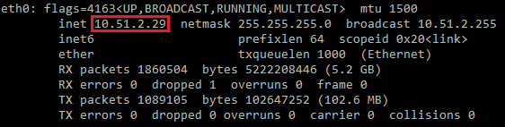
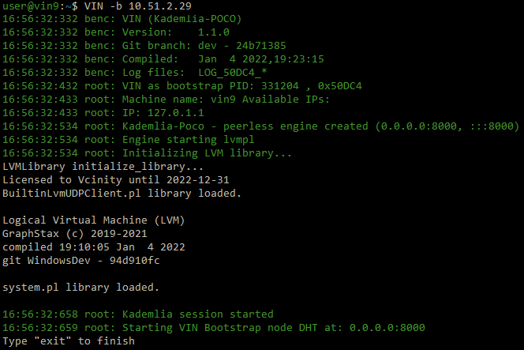
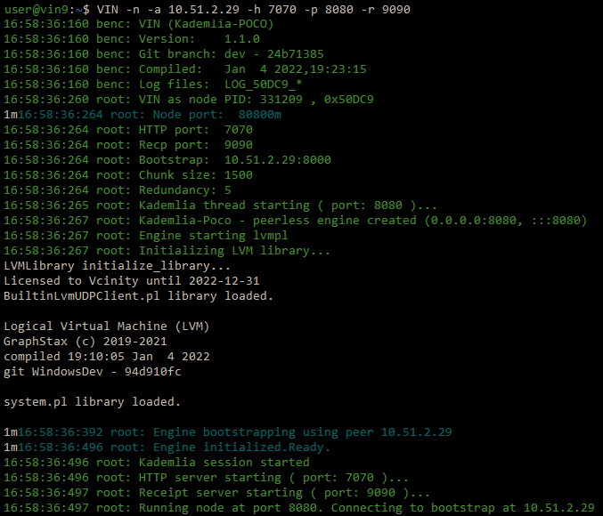
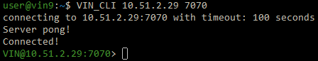
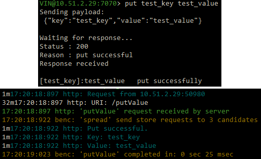
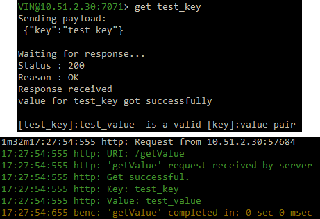
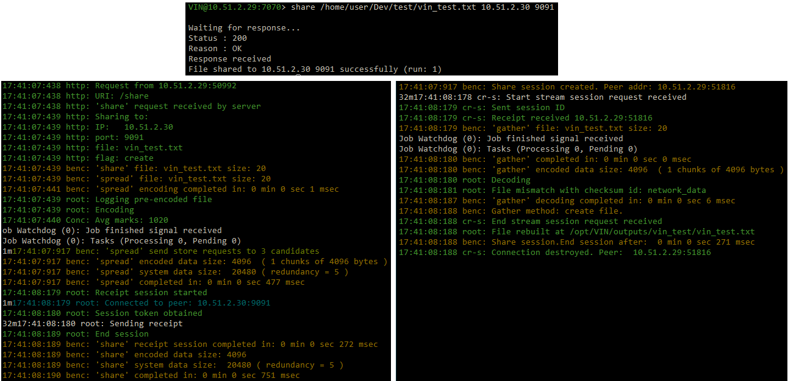
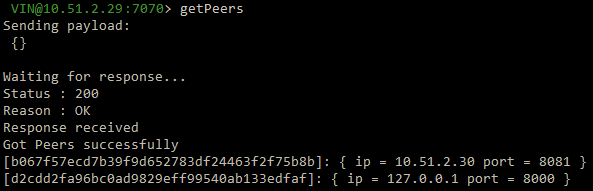
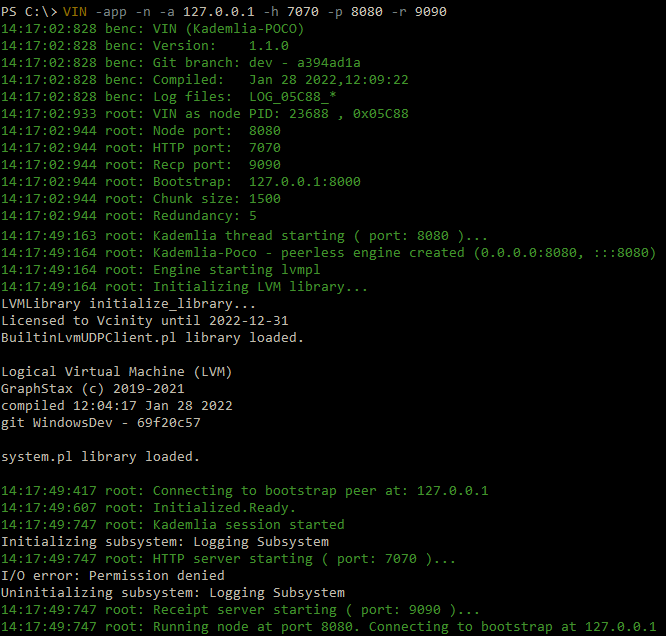

.. _running-the-vin-linux:

***********************************
Running the VIN™ on Linux
***********************************

Currently, there are two ways to set up the *VIN™*: on the same host system or through a local network. Both require very similar setups but differ in the way that peers are configured. The method for instantiating the *VIN™* for both cases and a example to demonstrate the *VIN™'s* ``put``, ``get``, ``spread``, ``gather``, ``share``, ``getPeers``, and ``shutdown`` commands are detailed in the upcoming sections. For detailed information on all of the commands available to the *VIN™*, refer to :ref:`vin-cli`. Before running the *VIN™*, it is good to become familiar with the *VIN™* command flags listed in the following table. Examples of how these are used will be shown when setting up the *VIN™*. 

Note: The logs of all the *VIN™* transactions are located in ``/var/log/VIN/logs/``. The examples were completed on virtual machines connected to a system running *Ubuntu*. If any issues occur while setting up the *VIN™* or while running any *VIN™ CLI* commands, refer to the :ref:`tips-troubleshooting-linux` section for assistance.

.. This information came from C:\Dev\qtoken-cpp\apps\helper.cpp 

.. csv-table:: VIN™ Command Flags
    :header: Flag Name, Command Line Instruction, Description
    :widths: 20 10 70

    List Flag, -l, "Displays a list out all *VIN™* flags along with their descriptions."
    Bootstrap Flag, -b, "Indicates that the node being instantiated will be a bootstrap node."
    Node Flag, -n, "Indicates that the node being instantiated will be a peer node."
    Configuration Directory Flag, -c, "Specify the location of a configuration file to start with."
    Bootstrap IP Flag, -a, "This flag specifies that the next string will be the bootstrap node's IP address which the peer will connect to."
    Bootstrap Port Flag, -s, "Specify a custom bootstrap port."
    Kademlia Port Flag, -p, "This flag specifies that the next string will be the Kademlia port through which the node will communicate bi-directionally with the Kademlia network."
    Receipt Port Flag, -r, "This flag specifies that the next string will be the port through which the node will receive its cryptographic receipts."
    HTTP Port Flag, -h, "This flag specifies that the next string will be the port utilized for HTTP messages by the node."
    LVM Port Flag, -v, "This flag specifies that the next string will be the port through which the node communicates with the *LVM*."

Setting up the *VIN™* on a Single Host Machine
================================================

While setting up the *VIN™* on single host machine doesn't represent a real-world scenario, it can be a useful architecture for developers to test and work with the *VIN™'s* functionality. To run a *VIN™* on a single host machine, a minimum of three *VIN™* nodes, one bootstrap node and two sender/receiver peer nodes, must be instantiated. Additionally, to perform commands with the network, the *VIN™ Command Line Interface* (*VIN™ CLI*) must be connected to one of the peer nodes. To do so, the following steps should be completed:

* With the *VIN™* installed (refer to :ref:`vin-install`, *VIN™* nodes can be launched from any directory using commands in a command line interface (CLI) terminal session. 
* Begin by opening four terminal sessions.
* In one of the sessions, run ``VIN -b 127.0.0.1``. This will serve as the bootstrap node with the IP address of the host (``127.0.0.1``) and will occupy port ``8000`` for incoming connections. Note: ``VIN -b`` will also work.

.. admonition:: Bootstrap Connection Output 
  :class: admonition-vin-run

  .. code-block:: none

    user@vin1:~$ VIN -b
    17:17:17:665 benc: VIN
    17:17:17:665 benc: Version:    1.12.3
    17:17:17:665 benc: Git branch: HEAD - da8fd80c
    17:17:17:665 benc: Compiled:   Apr  7 2022 , 15:28:19
    17:17:17:665 benc: Log files:  LOG_07C0F_*
    17:17:17:765 root: VIN initializing...
    LVMLibrary initialize_library...
    BuiltinLvmUDPClient.pl library loaded.

    Logical Virtual Machine (LVM)
    GraphStax (c) 2019-2021
    compiled 07:56:17 Dec 22 2021
    git WindowsDev - 94d910fc

    system.pl library loaded.

    17:17:17:819 root: License validated
    17:17:17:820 root: Recconnect time (s): 60
    17:17:17:820 root: VIN as bootstrap PID: 31759 , 0x07C0F
    17:17:17:820 root: Machine name: vin1 Available IPs:
    17:17:17:820 root: IP: 127.0.1.1
    17:17:17:921 root: Kademlia - peerless engine created (0.0.0.0:8000, :::8000)
    17:17:18:031 root: VIN bootstrap node started at: 0.0.0.0:8000

* In another session, run ``VIN -n -a 127.0.0.1 -h 7070 -p 8080 -r 9090``. This will start a *VIN™* peer node and connect it to the bootstrap which has an IP address of ``127.0.0.1``. The peer node runs with an HTTP port of ``7070``, a data (Kademlia) port of ``8080`` and a receipt server port of ``9090``. These ports can be chosen based on the requirements/restrictions of the user. WHile nodes are capable of both sending and receiving information, for clarity in this example, this node will be treated and referred to as a "sender" node.

.. admonition:: VIN™ Sender Peer Connection Output
  :class: admonition-vin-run

  .. code-block:: none
    
    user@vin1:~$ VIN -n -a 127.0.0.1 -h 7070 -p 8080 -r 9090
    18:10:28:288 benc: VIN
    18:10:28:288 benc: Version:    1.12.3
    18:10:28:288 benc: Git branch: HEAD - da8fd80c
    18:10:28:288 benc: Compiled:   Apr  7 2022 , 15:28:19
    18:10:28:288 benc: Log files:  LOG_07C25_*
    LVMLibrary initialize_library...
    18:10:28:389 root: VIN initializing...
    BuiltinLvmUDPClient.pl library loaded.

    Logical Virtual Machine (LVM)
    GraphStax (c) 2019-2021
    compiled 07:56:17 Dec 22 2021
    git WindowsDev - 94d910fc

    system.pl library loaded.

    18:10:28:415 root: License validated
    18:10:28:415 root: Using HTTP port: 7070
    18:10:28:415 root: Recconnect time (s): 60
    18:10:28:415 root: VIN as node PID: 31781 , 0x07C25
    18:10:28:416 fuse: Initializing fuse peer defaults
    Initializing subsystem: Logging Subsystem
    18:10:28:707 root: Node port:  8080
    18:10:28:707 root: HTTP port:  7070
    18:10:28:707 root: Recp port:  9090
    18:10:28:708 root: Bootstrap:  127.0.0.1:8000
    18:10:28:708 root: Chunk size: 1500
    18:10:28:708 root: Redundancy: 5
    18:10:28:710 root: Kademlia - peerless engine created (0.0.0.0:8080, :::8080)
    18:10:28:711 root: Connecting to bootstrap peer at: 127.0.0.1
    18:10:28:720 root: Initialized.Ready.
    18:10:28:830 root: Receipt server starting ( port: 9090 )...
    18:10:28:831 root: VIN node started. port: 8080 ;receipt port: 9090 ;http port: 7070
    18:10:28:831 root: Connected to bootstrap at: 127.0.0.1:8000
    FUSE: Interface thread started
    FUSE: Open pipe  

* On the third session run ``VIN -n -a 127.0.0.1 -h 7071 -p 8081 -r 9091``. Note that the HTTP, data and receipt ports are different than the node which was first instantiated. This node will be the "receiver" node for this example.

.. admonition:: VIN™ Receiver Peer Connection Output
  :class: admonition-vin-run

  .. code-block:: none

    user@vin1:~$ VIN -n -a 127.0.0.1 -h 7071 -p 8081 -r 9091
    18:13:56:809 benc: VIN
    18:13:56:809 benc: Version:    1.12.3
    18:13:56:809 benc: Git branch: HEAD - da8fd80c
    18:13:56:809 benc: Compiled:   Apr  7 2022 , 15:28:19
    18:13:56:809 benc: Log files:  LOG_07C8F_*
    LVMLibrary initialize_library...
    18:13:56:910 root: VIN initializing...
    BuiltinLvmUDPClient.pl library loaded.

    Logical Virtual Machine (LVM)
    GraphStax (c) 2019-2021
    compiled 07:56:17 Dec 22 2021
    git WindowsDev - 94d910fc

    system.pl library loaded.

    18:13:56:937 root: License validated
    18:13:56:937 root: Using HTTP port: 7071
    18:13:56:937 root: Recconnect time (s): 60
    18:13:56:937 root: VIN as node PID: 31887 , 0x07C8F
    18:13:56:940 root: Node port:  8081
    18:13:56:940 root: HTTP port:  7071
    18:13:56:940 root: Recp port:  9091
    18:13:56:940 root: Bootstrap:  127.0.0.1:8000
    18:13:56:940 root: Chunk size: 1500
    18:13:56:941 root: Redundancy: 5
    18:13:56:938 fuse: Initializing fuse peer defaults
    Initializing subsystem: Logging Subsystem
    18:13:56:944 root: Kademlia - peerless engine created (0.0.0.0:8081, :::8081)
    18:13:56:944 root: Connecting to bootstrap peer at: 127.0.0.1
    18:13:57:194 root: Initialized.Ready.
    18:13:57:305 root: Receipt server starting ( port: 9091 )...
    18:13:57:305 root: VIN node started. port: 8081 ;receipt port: 9091 ;http port: 7071
    18:13:57:306 root: Connected to bootstrap at: 127.0.0.1:8000
    FUSE: Interface thread started
    FUSE: Open pipe

* On the final session run ``VIN_CLI 127.0.0.1 7070``. This will successfully launch the *VIN™ CLI* and connect it to the peer with an HTTP port of ``7070``. If everything is working correctly, the CLI window should contain the following:

.. admonition:: VIN™ CLI Connection Output
  :class: admonition-vin-run

  .. code-block:: none

    user@vin1:~$ VIN_CLI 127.0.0.1 7070
    connecting to 127.0.0.1:7070 with timeout: 100 seconds
    Server pong!
    Connected!

Network Interaction on a Single Host Machine
------------------------------------------------

Put and Get A Key-Value Pair
^^^^^^^^^^^^^^^^^^^^^^^^^^^^^^^^^^^^^

The following will showcase how to a put key-value pair onto the network as a simple test to ensure the functionality of the *VIN™*. 

* To put a key-value onto the network, in the *VIN™ CLI* session run ``put <key> <value>``; where ``<key>`` and ``<value>`` can be any string that does not contain spaces. For this example ``test_key`` was used for the ``<key>`` and ``test_value`` for the ``<value>``. The following figure displays the result of running this command; where the top image is the output from the *VIN™ CLI* and the bottom is from the peer.

.. admonition:: Successful Put Output
  :class: admonition-vin-run

  :bold-underline:`VIN™ CLI Output`

  .. code-block:: none

    VIN@127.0.0.1:7070> put test_key test_value
    Sending payload:
    {"key":"test_key","value":"test_value"}

    Waiting for response...
    Status : 200
    Reason : 'putValue' successful:  Key: test_key ; Value: test_value
    Response received

    [test_key]:test_value   put successfully

  :bold-underline:`Peer Output`

  .. code-block:: none

    8:29:03:041 http: URI: /putValue ; request from: 127.0.0.1:51072
    18:29:03:041 http: 'putValue' request received
    18:29:03:041 http: 'putValue' successful:  Key: test_key ; Value: test_value
    18:29:03:041 benc: 'putValue' request latency 0 min 0 sec 0 msec

* To view the value that was placed on the *Kademlia* network, navigate to ``/opt/VIN/kademlia/data/`` and proceed through the folder structure.
* To get a value from the network, in the *VIN™ CLI* session run ``get <key>``; where ``<key>`` is ``test_key`` for this example. The following figure displays the result of running this command; where the top image is the output from the *VIN™ CLI* and the bottom is from the peer.

.. admonition:: Successful Get Output
  :class: admonition-vin-run

  :bold-underline:`VIN™ CLI Output`

  .. code-block:: none

    VIN@127.0.0.1:7070> get test_key
    Sending payload:
    {"key":"test_key"}

    Waiting for response...
    Status : 200
    Reason : OK
    Response received
    value for test_key got successfully

    [test_key]:test_value  is a valid [key]:value pair

  :bold-underline:`Peer Output`

  .. code-block:: none

    18:53:04:111 http: URI: /getValue ; request from: 127.0.0.1:51076
    18:53:04:111 http: 'getValue' request received
    18:53:04:111 http: 'getValue' successful:  Key: test_key ; Value: test_value
    18:53:04:112 benc: 'getValue' request latency 0 min 0 sec 0 msec

Spread and Gather a File
^^^^^^^^^^^^^^^^^^^^^^^^^^^^^^^

The *VIN™* can spread any file type onto it's network. To do a ``spread``, perform the following:

* In the *VIN™ CLI* session run ``spread <filepath>``; where the ``<filepath>`` is the absolute path and name of the file to be spread. For this example, it is ``/home/user/Dev/vin_test.txt``. For all of the options available to ``spread``, refer to :ref:`vin-cli`. An encrypted cryptographic receipt is generated upon spreading and is stored in ``/opt/VIN/receipts/sent`` and the encrypted data is placed onto the *Kademlia* network and can be seen in ``/opt/VIN/kademlia/data/``. Additionally, the data, broken into shards, is viewable in ``/var/log/VIN/shards/``. Note: the number of shards is dependant on the size of the file and the parameters set in the ``chunker`` object, which is set in ``defaults.cfg`` (see :ref:`vin-configuration` for more details).
* The output of a successful ``spread`` is shown below.

.. admonition:: Successful Spread Output
  :class: admonition-vin-run

  :bold-underline:`VIN™ CLI Output`

  .. code-block:: none

    VIN@127.0.0.1:7070> spread /home/user/Dev/vin_test.txt

    Waiting for response...
    Status : 200
    Reason : OK
    Response received
    File spread successfully

    Receipt saved to location : /opt/VIN/receipts/sent/CR1299958208

  :bold-underline:`Peer Output`

  .. code-block:: none

    18:56:39:390 http: URI: /spread ; request from: 127.0.0.1:51078
    18:56:39:390 http: 'spread' request received
    18:56:39:391 root: Using default coders pipeline
    18:56:39:391 root: Validate encoders...
    18:56:39:391 root: Enc: ConcurrentEncoder EntanglementEncoder NamingEncoder ValidationEncoder
    18:56:39:391 root: Validate decoders...
    18:56:39:391 root: Dec: ValidationDecoder EntanglementDecoder ConcurrentDecoder
    18:56:39:391 root: Validate channels...
    18:56:39:391 root: No channels specified
    18:56:39:391 root: Logging pre-encoded file
    18:56:39:392 root: Encoding
    18:56:39:391 benc: 'spread' chunking latency 0 min 0 sec 0 msec
    18:56:39:391 benc: 'spread' file: vin_test.txt size: 27
    18:56:39:395 benc: 'spread' encoding latency 0 min 0 sec 3 msec
    18:56:39:395 enco: ConcurrentEncoder: avg marks: 1017
    18:56:39:871 benc: Found: 3 peers
    Job Watchdog (0): Job finished signal received
    Job Watchdog (0): Tasks (Processing 0, Pending 0)
    18:56:39:872 http: 'spread' receipt saved to: /opt/VIN/receipts/sent/CR1299958208
    18:56:39:872 benc: 'spread' uploading latency 0 min 0 sec 476 msec
    18:56:39:872 benc: 'spread' total latency 0 min 0 sec 480 msec
    18:56:39:872 benc: 'spread' encoded data size: 4096  ( 1 chunks of 4096 bytes )
    18:56:39:872 benc: 'spread' system data size:  20480 ( redundancy = 5 )

* After a file has been spread to the network a cryptographic receipt will be generated. Using this receipt, the file can be retrieved from the network via the ``gather`` command. To do a basic ``gather``, in the *VIN™ CLI* session run ``gather <receipt_path>``. The ``<receipt_path>`` will be shown in the *VIN™ CLI* session and, for this example, is ``/opt/VIN/receipts/sent/CR1299958208``. For all of the options available to ``gather``, refer to :ref:`vin-cli`. If the file was successfully gathered, the following output should be displayed.

.. admonition:: Successful Gather Output
  :class: admonition-vin-run

  :bold-underline:`VIN™ CLI Output`

  .. code-block:: none
    
    VIN@127.0.0.1:7070> gather /opt/VIN/receipts/sent/CR1299958208

    Waiting for response...
    Status : 200
    Reason : OK
    Response received
    File gathered successfully

    File reconstructed at : /opt/VIN/outputs/vin_test/vin_test.txt on node host.
    

  :bold-underline:`Peer Output`

  .. code-block:: none
    
    19:01:24:611 http: URI: /gather ; request from: 127.0.0.1:51080
    19:01:24:611 http: 'gather' request received
    19:01:24:612 benc: 'gather' file: vin_test.txt size: 27
    19:01:24:612 root: Dec: ValidationDecoder EntanglementDecoder ConcurrentDecoder
    Job Watchdog (0): Job finished signal received
    Job Watchdog (0): Tasks (Processing 0, Pending 0)
    19:01:24:614 benc: 'gather' acquisition latency 0 min 0 sec 2 msec
    19:01:24:614 benc: 'gather' encoded data size: 4096  ( 1 chunks of 4096 bytes )
    19:01:24:614 root: Decoding
    19:01:24:621 benc: 'gather' decoding latency 0 min 0 sec 7 msec
    19:01:24:622 benc: 'gather' total latency 0 min 0 sec 9 msec
    19:01:24:623 root: File rebuild at: /opt/VIN/outputs/vin_test/vin_test.txt

* To inspect the gathered file, navigate to ``/opt/VIN/outputs`` and enter ``ls``. A folder with the name of the file which was gathered should be listed. Enter this folder (``cd <folder_name>``) and run ``ls``. The file which was shared will be displayed and can be inspected to ensure it was successfully gathered. 
* Note: the ``gather`` command, by default, will create a new file on the system after it finishes; thus, the gathered file may have a number appended to end of the filename. For more information on how to overwrite the file, or append to its contents, refer to the :ref:`vincli-commands` table.

Sharing a File
^^^^^^^^^^^^^^^^^^

The following will describe how to share files between the peers on the same host system.

* In the *VIN™ CLI* session, the following command should be run after the required information is determined: ``share <filepath> <ip_address> <receipt_port>``. ``<filepath>`` is the absolute path and filename of the file to be shared, for example, in this case it is ``/home/user/Dev/vin_test.txt``. Note: any file type can be shared. The ``<ip_address>`` and ``<receipt_port>`` are ``127.0.0.1`` and ``9091``, or the IP address of the host system and the ``receipt_port`` of the second peer running on it.
* Thus, the command to run, for this example, becomes ``share /home/user/Dev/vin_test.txt 127.0.0.1 9091``. For all of the options available to ``share``, refer to :ref:`vin-cli`. If everything worked correctly, the following should be displayed on the CLI sessions. 

.. admonition:: Successful Get Output
  :class: admonition-vin-run

  :bold-underline:`VIN™ CLI Output`

  .. code-block:: none

    share /home/user/Dev/vin_test.txt 127.0.0.1 9091

    Waiting for response...
    Status : 200
    Reason : OK
    Response received
    File shared to 127.0.0.1 9091 successfully (run: 1)

  :bold-underline:`Peer 1 Output`

  .. code-block:: none

    19:06:55:723 http: URI: /share ; request from: 127.0.0.1:51082
    19:06:55:723 http: 'share' request received
    19:06:55:723 root: Using default coders pipeline
    19:06:55:723 benc: 'share' chunking latency 0 min 0 sec 0 msec
    19:06:55:723 http: Share to: 127.0.0.1:9091 ; File: vin_test.txt ; Size: 27 ; Flag: create
    19:06:55:723 root: Validate encoders...
    19:06:55:723 root: Enc: ConcurrentEncoder EntanglementEncoder NamingEncoder ValidationEncoder
    19:06:55:723 root: Validate decoders...
    19:06:55:723 root: Dec: ValidationDecoder EntanglementDecoder ConcurrentDecoder
    19:06:55:723 root: Validate channels...
    19:06:55:723 root: No channels specified
    19:06:55:723 root: Logging pre-encoded file
    19:06:55:724 root: Encoding
    19:06:55:723 benc: 'spread' file: vin_test.txt size: 27
    19:06:55:726 enco: ConcurrentEncoder: avg marks: 1017
    19:06:55:727 benc: 'spread' encoding latency 0 min 0 sec 3 msec
    Job Watchdog (0): Job finished signal received
    Job Watchdog (0): Tasks (Processing 0, Pending 0)
    19:06:55:962 benc: 'spread' uploading latency 0 min 0 sec 235 msec
    19:06:55:962 benc: 'spread' total latency 0 min 0 sec 238 msec
    19:06:55:962 benc: 'spread' encoded data size: 4096  ( 1 chunks of 4096 bytes )
    19:06:55:962 benc: 'spread' system data size:  20480 ( redundancy = 5 )
    19:06:55:962 root: Sharing to peer: 127.0.0.1:9091
    19:06:55:969 root: Receipt session started
    19:06:55:969 root: Connected to peer: 127.0.0.1:9091
    19:06:55:970 root: Session token obtained
    19:06:55:970 root: Sending receipt
    19:06:56:981 root: Sending status request
    19:06:56:983 root: Status: File rebuild OK
    19:06:56:983 root: Sharing end session
    19:06:56:983 benc: 'share' receipt latency 0 min 1 sec 20 msec
    19:06:56:983 benc: 'share' encoded data size: 4096
    19:06:56:983 benc: 'share' system data size:  20480 ( redundancy = 5 )
    19:06:56:983 benc: 'share' total latency 0 min 1 sec 260 msec

  :bold-underline:`Peer 2 Output`

  .. code-block:: none

    19:06:55:963 benc: Share session created. Peer addr: 127.0.0.1:43648
    19:06:55:971 root: Dec: ValidationDecoder EntanglementDecoder ConcurrentDecoder
    19:06:55:971 benc: 'gather' file: vin_test.txt size: 27
    19:06:55:970 cr-s: Start sharing session
    19:06:55:970 cr-s: Send session id
    19:06:55:971 cr-s: Receipt received from: 127.0.0.1:43648
    Job Watchdog (110): Tasks (Processing 0, Pending 0)
    19:06:56:973 benc: 'gather' acquisition latency 0 min 1 sec 1 msec
    19:06:56:973 benc: 'gather' encoded data size: 4096  ( 1 chunks of 4096 bytes )
    19:06:56:973 root: Decoding
    19:06:56:980 benc: 'gather' decoding latency 0 min 0 sec 7 msec
    19:06:56:980 benc: 'gather' total latency 0 min 1 sec 9 msec
    19:06:56:981 cr-s: Status request from: 127.0.0.1:43648
    19:06:56:982 benc: 'gather' end_stream_session
    19:06:56:982 root: File rebuild at: /opt/VIN/outputs/vin_test/vin_test(1).txt
    19:06:56:982 benc: 'gather' rebuilt latency: 0 min 0 sec 0 msec
    19:06:56:984 cr-s: Status: File rebuild OK
    19:06:56:984 cr-s: Share ended. 0 min 1 sec 21 msec
    19:06:57:035 cr-s: Connection with peer: 127.0.0.1:43648 ended

* To manually confirm that the file was shared correctly, enter ``ls`` in the CLI session pointing to the ``/opt/VIN/outputs`` folder directory. A folder with the name of the file which was shared should be listed. Enter this folder (``cd <folder_name>``) and run ``ls``. The file which was shared will be displayed and can be inspected to ensure it was successfully shared.
* Additionally, the cryptographic receipt for the share is stored in ``/opt/VIN/receipts/sent``, the encrypted data can be seen in ``/opt/VIN/kademlia/data/``, and the sharded data is viewable in ``/var/log/VIN/shards/``. Note: the number of shards is dependant on the size of the file and the parameters set in the ``chunker`` object, which is set in ``defaults.cfg`` (see :ref:`vin-configuration` for more details).

Getting Peers Connected to a Peer
""""""""""""""""""""""""""""""""""""""""

In the *VIN™ CLI* session run ``getPeers`` to generate a list of all peers connected to a bootstrap node. The result will be an output similar to the one displayed in the figure below.  

.. admonition:: Successful GetPeers Output
  :class: admonition-vin-run

  :bold-underline:`VIN™ CLI Output`

  .. code-block:: none

    VIN@127.0.0.1:7070> getPeers
    Sending payload:
    {}

    Waiting for response...
    Status : 200
    Reason : OK
    Response received
    Got Peers successfully
    {
        "127.0.0.1:8000": {
            "ip": "127.0.0.1",
            "meta_data": {
            },
            "port": "8000"
        },
        "127.0.0.1:8081": {
            "ip": "127.0.0.1",
            "meta_data": {
                "http_port": "7071",
                "kad_port": "8081",
                "receipt_port": "9091"
            },
            "port": "8081"
        }
    }

  :bold-underline:`Peer 1 Output`

  .. code-block:: none

    20:27:00:685 http: URI: /getPeers ; request from: 127.0.0.1:51118
    20:27:00:685 http: 'getPeers' request received
    20:27:00:947 benc: Found: 3 peers
    20:27:00:948 http: Listing peer: 127.0.0.1:8000
    20:27:00:948 http: MetaData: {}
    20:27:00:948 http: Listing peer: 127.0.0.1:8081
    20:27:00:948 http: MetaData: {"kad_port":"8081","receipt_port":"9091","http_port":"7071"}

As two nodes (the bootstrap and Peer 2) are connected to Peer 1, the results contain two outputs. The first listed is the bootstrap (``127.0.0.1:8000``), while the second is Peer 2 (``127.0.0.1:8081``). Note how Peer 2 contains additional port information which was supplied during its instantiation.

Shutting Down the Network
"""""""""""""""""""""""""

:bold-underline:`Bootstrap`

* Press **ctrl + c** while the bootstrap node's terminal session is active to stop the process.

.. admonition:: Bootstrap Shutdown
  :class: admonition-vin-run

  :bold-underline:`VIN™ CLI Output`

  .. code-block:: none
    
    20:33:25:500 root: VIN exit

:bold-underline:`Peer Connection To *VIN™ CLI* (Sender Peer)`

* To shutdown a peer node which is connected to the *VIN™ CLI*, run ``shutdown`` in the *VIN™ CLI* session connected to the peer. Alternatively, press **ctrl + c** while the peer node's terminal session is active to end the process.

.. admonition:: Peer 1 Connected to VIN CLI Shutdown
  :class: admonition-vin-run

  :bold-underline:`VIN™ CLI Output`

  .. code-block:: none
    
    VIN@127.0.0.1:7070> shutdown
    <h1>Exit<h1>

  :bold-underline:`Peer 1 Output`

  .. code-block:: none

    20:34:51:455 http: URI: /exit ; request from: 127.0.0.1:51120
    20:34:51:455 http: 'exit' request received
    20:34:51:455 http: HTTP server exit
    Uninitializing subsystem: Logging SubsystemFUSE: Handle end thread signal 10
  
    20:34:55:871 root: VIN exit

:bold-underline:`Peer not Connection To *VIN™ CLI* (Receiver Peer)`

* Press **ctrl + c** while the peer node's terminal session is active to kill the process.

.. admonition:: Peer 1 Not Connected to VIN CLI Shutdown
  :class: admonition-vin-run

  :bold-underline:`Peer 2 Output`

  .. code-block:: none

    20:36:16:654 http: HTTP server exit

:bold-underline:`*VIN™ CLI*`

* To exit from the *VIN™ CLI*, type **exit** and hit **enter** in the *VIN™ CLI* session. Alternatively, press **ctrl + c**.

.. admonition:: Peer 2 Connected to VIN CLI Shutdown
  :class: admonition-vin-run

  :bold-underline:`VIN™ CLI Output`

  .. code-block:: none
    
    VIN@127.0.0.1:7070> exit
    So long for now.

.. _local-network-linux:

Setting up the *VIN™* on a Local Network 
===========================================

To run a basic *VIN™* on an IP based network, such as *Amazon Web Services (AWS)*, a Local Area Network (LAN) with routers/switches and Dynamic Host Communication Protocol (DHCP), *VMware*, etc., complete the following steps:

* For this example, two systems will be used: ``system_1`` and ``system_2``.
* Complete the *VIN™* installation procedure on each system.
* On each system, open three CLI sessions. 
* Since each system will have it's own IP address, deemed ``<ip_1>`` and ``<ip_2>`` for this example, it is imperative to determine and record it.
* Run ``ifconfig`` in one of the CLI sessions. Note: if this feature is not installed a message will appear recommending that ``sudo apt-get install -y net-tools`` be run. If this is the case, run this command and re-run ``ifconfig`` to generate an output similar to the one below. 
  

  ifconfig Results
  
* Record the address next to the ``inet`` parameter for the required network connection (i.e., wired or wireless). In the image, the ``inet`` corresponding to an ethernet connection, ``eth0``, was recorded as ``<ip_1>``.
* Repeat the above instructions for ``system_2`` and record ``<ip_2>``.
* In one of the three sessions on ``system_1``, run ``VIN -b <ip_1>`` (``VIN -b`` will also work). For this example, ``<ip_1>`` is ``10.51.2.29``. This will serve as the bootstrap node and will occupy port ``8000`` for incoming connections. If the bootstrap was successfully launched, the CLI session will output similar results to those in the following figure.

  Bootstrap Connected Successfully

* In another session on ``system_1``, run ``VIN -n -a <ip_1> -h 7070 -p 8080 -r 9090``. This will start a *VIN™* peer node with an HTTP port of ``7080``, a data (*Kademlia*) port of ``8080`` and a receipt server port of ``9090`` and connect to the bootstrap on ``<ip_1>``. Note: these ports can be chosen based on the requirements/restrictions of the user. 
* If the peer connects to the bootstrap successfully the session will contain a similar output to the one in the figure below. Take note that it displays the ports and IP address that was used during the peer's instantiation.

  Peer Connected Successfully

* In the third session on ``system_1``, run ``VIN_CLI <ip_1> 7070``. This will launch the *VIN™ CLI* if the above steps were completed successfully. If everything is working correctly, the CLI session should contain the following:

  *VIN™ CLI* Connected Successfully

* In a session on ``system_2``, run ``VIN -n -a <ip_1> -h 7071 -p 8081 -r 9091``, where ``<ip_1>`` is ``10.51.2.29`` for this example. This will connect to the bootstrap located on ``system_1`` with its IP address of ``<ip_1>``.
* In the second session, run ``VIN_CLI <ip_2> 7071`` to connect to the peer on ``system_2`` using ``<ip_2>`` (or ``10.51.2.30`` for this example).  
* In the final session, navigate to  ``/opt/VIN/outputs``. This directory will contain the received file after it has been reconstructed during the example in the following section. 

Network Interaction on a Local Network 
-------------------------------------------

With *VIN™* peers successfully running on both systems, a number of commands can be entered to interact with the instantiated network and between the peers themselves. The following examples will highlight the use of the ``put``, ``get``, ``share``, ``getPeers`` and ``shutdown`` commands with the *VIN™ CLI*. Note: ``spread`` and ``gather`` are not shown for a local network as the cryptographic receipt generated by ``spread``, which is required by ``gather``, is stored on the system that performed the ``spread``. While manually copying the file to the other system and then running ``gather`` is feasible, testing ``spread`` and ``gather`` is best done on a single host network. For a full list of the *VIN™ CLI's* functionality refer to :ref:`vin-cli`. Additionally, refer to :ref:`vin-configuration` for more information regarding locations of files generated while using the *VIN™ CLI*.

Putting and Getting A Key-Value Pair
^^^^^^^^^^^^^^^^^^^^^^^^^^^^^^^^^^^^^^

The following will showcase how to a put key-value pair onto the network as a simple test to ensure the functionality of the *VIN™*. While the *VIN™ CLI* connected to the peer on ``system_1`` will be utilized for the ``put``, any peer/*VIN™ CLI* connection has this capability. 

* To put a key-value onto the network, in the *VIN™ CLI* session on ``system_1``, run ``put <key> <value>``; where ``<key>`` and ``<value>`` can be any string that does not contain spaces. For this example ``test_key`` was used for the ``<key>`` and ``test_value`` for the ``<value>``. The following figure displays the result of running this command; where the top image is the output from the *VIN™ CLI* and the bottom is from the peer.

  Successful Put (*VIN™ CLI* = top, Peer_1 = bottom)

* To view the shard that was placed on the *Kademlia* network, navigate to ``/opt/VIN/kademlia/data/`` and proceed through the folder structure until reaching the file.
* To get a value from the network, in the *VIN™ CLI* session on ``system_2``, run ``get <key>``; where ``<key>`` is ``test_key`` for this example. The following figure displays the result of running this command; where the top image is the output from the *VIN™ CLI* and the bottom is from the peer.

  Successful Get (*VIN™ CLI* = top, Peer_2 = bottom)

Sharing a File
^^^^^^^^^^^^^^^^

The following will describe how to share files between the peer on ``system_1`` to the peer located on ``system_2``. Note: the peer/*VIN™ CLI* connection on ``system_2`` could also be used to perform the share.

* In the *VIN™ CLI* session on ``system_1``, the following command should be run after the required information is determined: ``share <filepath> <ip_address> <receipt_port>``. ``<filepath>`` is the absolute path and filename of the file to be shared, for example, in this case it is ``/home/user/Dev/test/vin_test.txt``. Note: any file type can be shared. The ``<ip_address>`` and ``<receipt_port>`` are ``<ip_2>`` (or ``10.51.2.30`` for this example) and ``9091``, or the IP address of ``system_2`` and the ``receipt_port`` of the peer running on it.
* Thus, the command to run, for this example, becomes ``share /home/user/Dev/test/vin_test.txt 10.51.2.30 9091``. If everything worked correctly, the following should be displayed on ``system_1`` and ``system_2``. 

  Successful Share Between Peers (*VIN™ CLI* = top, Peer_1 = left, Peer_2 = right)

* To manually confirm that the file was shared correctly, enter ``ls`` in the CLI session on ``system_2`` pointing to the ``/opt/VIN/outputs`` folder directory. A folder with the name of the file which was shared should be listed. Enter this folder (``cd <folder_name>``) and run ``ls``. The file which was shared will be displayed and can be inspected to ensure it was successfully shared.
* Additionally, the cryptographic receipt for the share is stored in ``/opt/VIN/receipts/sent``, the encrypted data can be seen in ``/opt/VIN/kademlia/data/``, and the sharded data is viewable in ``/var/log/VIN/shards/``. Note: the number of shards is dependant on the size of the file and the parameters set in the ``chunker`` object, which is set in ``defaults.cfg`` (see :ref:`vin-configuration` for more details).

Getting Peers Connected to the Bootstrap
^^^^^^^^^^^^^^^^^^^^^^^^^^^^^^^^^^^^^^^^^

In the *VIN™ CLI* session on ``system_1``, run ``getPeers`` to generate a list of all peers connected to a bootstrap node. The result will be an output similar to the one displayed in the figure below.  

  GetPeers Result

For this example, there are two peers with their information listed as follows: ``[unique_node_identifier: { ip_address_of_peers_host peers_data_port }]``

Shutting Down a Node
^^^^^^^^^^^^^^^^^^^^^^^^^^^^^

* Press **ctrl + c** while the bootstrap node's CLI session is active to kill the process.
* To shutdown a peer node which is connected to the *VIN™ CLI*, run ``shutdown`` in the *VIN™ CLI* session connected to the peer. Alternatively, press **ctrl + c** while the peer node's CLI session is active to kill the process.
* To exit from the *VIN™ CLI*, type **exit** and hit **enter** in the *VIN™ CLI* session. Alternatively, press **ctrl + c** while theCLI session containing the *VIN™ CLI* is active to kill the process.

================================================================================

.. _tips-troubleshooting-linux:

Tips and Troubleshooting
========================

This section details tips for using the *VIN™* as well as highlights troubleshooting for issues that may occur while utilizing the *VIN's™* functionality.

..
  Bootstrap Error During Instantiation
  ------------------------------------

  If a bootstrap node is running and another bootstrap attempts be to instantiated, an error similar to the one in the figure below will appear in the CLI session. Note: though the figure below was captured on a *Linux* OS, a similar error will be present on other operating systems.

  .. figure:: images/getting_started_with_vin/troubleshooting/bootstrap_connection_error.png
    :scale: 100
    :align: center
    :alt: Bootstrap Connection Error

    Bootstrap Connection Error

  To stop the bootstrap and allow another bootstrap node to run, perform the following based upon the OS in use:

  *Linux*
  ^^^^^^^

  * Shutdown all *VIN™* nodes and *VIN™ CLI* sessions
  * Open a CLI session and run ``sudo ps -a`` and ensure that at least one ``VIN`` process is running. Note: multiple ``VIN`` processes may be listed if there are *VIN™* peers running.
  * Run ``killall VIN`` to stop all of the ``VIN`` processes.

  *Windows*
  ^^^^^^^^^

  * Shutdown all *VIN™* nodes and *VIN™ CLI* sessions
  * Open a CLI session and run ``tasklist`` and ensure that at least one ``VIN.exe`` process is running. Note: multiple ``VIN`` processes may be listed if there are *VIN™* peers running.
  * Run ``taskkill /IM "VIN.exe" /F`` to stop all of the ``VIN.exe`` processes.

I/O error : Permission denied
-----------------------------

If this error is present when attempting to connect a peer to a bootstrap node, it is due to one of the peer's ports being in use by another program on the system. In the image below, the error succeeds the ``HTTP server starting ( port: 7070)`` indicating that port 7070 is in use. 

.. admonition:: Successful Get Output
  :class: admonition-vin-run

  :bold-underline:`VIN™ CLI Output`

  .. code-block:: none

  I/O Permission Error

A solution to the issue is to specify the *VIN™* peer with another HTTP port. Another possibility is to determine which program is using the port in question and to shut it down.