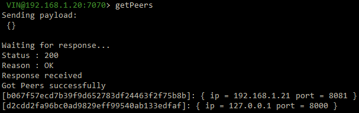
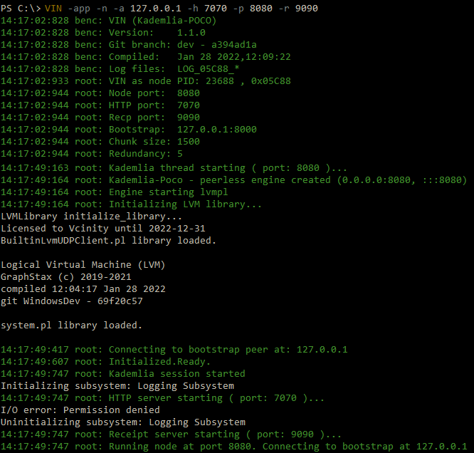

.. _running-the-vin-windows:

***********************************
Running the VIN™ on Windows
***********************************

Currently, there are two ways to set up the *VIN™*: on the same host system or through a local network. Both require very similar setups but differ in the way that peers are configured. The method for instantiating the *VIN™* for both cases and a example to demonstrate the *VIN™'s* ``put``, ``get``, ``spread``, ``gather``, ``share``, ``getPeers``, and ``shutdown`` commands are detailed in the upcoming sections. For detailed information on all of the commands available to the *VIN™*, refer to :ref:`vin-cli`. Before running the *VIN™*, it is good to become familiar with the *VIN™* command flags listed in the following table. Examples of how these are used will be shown when setting up the *VIN™*. 

Note: The logs of all the *VIN™* transactions are located in ``C:\ProgramData\VIN\logs\``. The examples were completed on virtual machines connected to a system running *Windows 10*. 

.. csv-table:: VIN™ Command Flags
    :header: Flag Name, Command Line Instruction, Description
    :widths: 20 10 70 

    List Flag, -l, "Displays a list out all *VIN™* flags along with their descriptions."
    Bootstrap Flag, -b, "Indicates that the node being instantiated will be a bootstrap node."
    Node Flag, -n, "Indicates that the node being instantiated will be a peer node."
    Configuration Directory Flag, -c, "Specify the location of a configuration file to start with."
    Bootstrap IP Flag, -a, "This flag specifies that the next string will be the bootstrap node's IP address which the peer will connect to."
    Bootstrap Port Flag, -s, "Specify a custom bootstrap port."
    Kademlia Port Flag, -p, "This flag specifies that the next string will be the Kademlia port through which the node will communicate bi-directionally with the Kademlia network."
    Receipt Port Flag, -r, "This flag specifies that the next string will be the port through which the node will receive its cryptographic receipts."
    HTTP Port Flag, -h, "This flag specifies that the next string will be the port utilized for HTTP messages by the node."
    LVM Port Flag, -v, "This flag specifies that the next string will be the port through which the node communicates with the *LVM*."
    

Setting up the VIN™ on a Single Host Machine
================================================

While setting up the *VIN™* on single host machine doesn't represent a real-world scenario, it can be a useful architecture for developers to test and work with the *VIN™'s* functionality. To run a *VIN™* on a single host machine, a minimum of three *VIN™* nodes, one bootstrap node and two sender/receiver peer nodes, must be instantiated. Additionally, to perform commands with the network, the *VIN™ Command Line Interface* (*VIN™ CLI*) must be connected to one of the peer nodes. To do so, the following steps should be completed:

* With the *VIN™* installed (refer to :ref:`vin-install`), *VIN™* nodes can be launched from any directory using commands in a command line interface (CLI) terminal session. 
* Begin by opening four terminal windows.
* In one of the sessions, run ``VIN -app -b 127.0.0.1``. This will serve as the bootstrap node with the IP address of the host (``127.0.0.1``) and will occupy port ``8000`` for incoming connections. Note: ``VIN -app -b`` will also work.

.. admonition:: Bootstrap Connection Output 
  :class: admonition-vin-run

  .. code-block:: none

    XXXX

* In another terminal window, run ``VIN -app -n -a 127.0.0.1 -h 7070 -p 8080 -r 9090``. This will start a *VIN™* peer node and connect it to the bootstrap which has an IP address of ``127.0.0.1``. The peer node runs with an HTTP port of ``7070``, a data (Kademlia) port of ``8080`` and a receipt server port of ``9090``. These ports can be chosen based on the requirements/restrictions of the user. While peers are capable of both sending and receiving information, for clarity in this example, this peer will be treated and referred to as a ``sender`` peer.

.. admonition:: VIN™ Sender Peer Connection Output
  :class: admonition-vin-run

  .. code-block:: none

    XXXX

* On the third terminal window run ``VIN -app -n -a 127.0.0.1 -h 7071 -p 8081 -r 9091``. Note that the HTTP, data and receipt ports are different than the node which was first instantiated. This peer will be the ``receiver`` peer for this example.

.. admonition:: VIN™ Receiver Peer Connection Output
  :class: admonition-vin-run

  .. code-block:: none

    XXXX

* On the fourth terminal window run ``VIN_CLI 127.0.0.1 7070``. This will successfully launch the *VIN™ CLI* and connect it to the ``sender`` peer with the HTTP port of ``7070``. If everything is working correctly, the terminal window should contain the following:

.. admonition:: VIN™ CLI Connection Output
  :class: admonition-vin-run

  :bold-underline:`VIN™ CLI Output`

  .. code-block:: none

    XXXX

  :bold-underline:`Sender Peer Output`

  .. code-block:: none

    XXXX

Network Interaction on a Single Host Machine
---------------------------------------------

Put and Get A Key-Value Pair
^^^^^^^^^^^^^^^^^^^^^^^^^^^^^^^^^^^^^

The following will showcase how to a put key-value pair onto the network as a simple test to ensure the functionality of the *VIN™*. 

* To put a key-value onto the network, in the *VIN™ CLI* terminal window run ``put <key> <value>``; where ``<key>`` and ``<value>`` can be any string that does not contain spaces. For this example ``test_key`` was used for the ``<key>`` and ``test_value`` for the ``<value>``. The following figure displays the result of running this command; where the top image is the output from the *VIN™ CLI* and the bottom is from the peer.

.. admonition:: Successful Put Output
  :class: admonition-vin-run

  :bold-underline:`VIN™ CLI Output`

  .. code-block:: none

    XXXX

  :bold-underline:`Sender Peer Output`

  .. code-block:: none

    XXXX

* To view the value that was placed on the *Kademlia* network, navigate to ``C:\ProgramData\VIN\kademlia\data\`` and proceed through the folder structure.
* To get a value from the network, in the *VIN™ CLI* terminal window run ``get <key>``; where ``<key>`` is ``test_key`` for this example. The following displays the result of running this command; where the top image is the output from the *VIN™ CLI* and the bottom is from the ``sender`` peer.

.. admonition:: Successful Get Output
  :class: admonition-vin-run

  :bold-underline:`VIN™ CLI Output`

  .. code-block:: none

    XXXX

  :bold-underline:`Sender Peer Output`

  .. code-block:: none

    XXXX

Spread and Gather a File
^^^^^^^^^^^^^^^^^^^^^^^^^^^^^^^

The *VIN™* can spread any file type onto its network. To do a ``spread`` its default configuration (see :ref:`vin-configuration` and :ref:`vin-cli` for more details), perform the following:

* In the *VIN™ CLI* terminal window run ``spread <filepath>``; where the ``<filepath>`` is the path and name of the file to be spread. For this example, it is ``C:\Dev\test\vin_test.txt``. An encrypted cryptographic receipt is generated upon spreading and is stored in ``C:\ProgramData\VIN\receipts\sent\`` and the encrypted data is placed onto the *Kademlia* network and can be seen in ``C:\ProgramData\VIN\kademlia\data\``. Additionally, the data, broken into shards, is viewable in ``C:\ProgramData\VIN\shards\``. Note: the number of shards is dependant on the size of the file and the parameters set in the ``chunker`` object, which is set in ``defaults.cfg`` (see :ref:`vin-configuration` for more details).
* The output of a successful ``spread`` is shown below.

.. admonition:: Successful Spread Output
  :class: admonition-vin-run

  :bold-underline:`VIN™ CLI Output`

  .. code-block:: none

    XXXX

  :bold-underline:`Sender Peer Output`

  .. code-block:: none

    XXXX

* After a file has been spread to the network a cryptographic receipt will be generated on the ``sender`` peer with the path and filename listed in the ``sender`` peers terminal output (for this example it is ``C:\ProgramData\VIN\receipts\sent\XXXX``). Using this receipt, the file can be retrieved from the network via the ``gather`` command. To do a ``gather`` with its default configuration, in the *VIN™ CLI* terminal window run ``gather <receipt_path>`` where the ``<receipt_path>`` is ``C:\ProgramData\VIN\receipts\sent\XXXX``. For all of the options available to ``gather``, refer to :ref:`vin-cli`. If the file was successfully gathered, the following output should be displayed.

.. admonition:: Successful Gather Output
  :class: admonition-vin-run

  :bold-underline:`VIN™ CLI Output`

  .. code-block:: none
    
    XXXX
    

  :bold-underline:`Sender Peer Output`

  .. code-block:: none
    
    XXXX

* To inspect the gathered file, navigate to ``C:\ProgramData\VIN\outputs\`` and enter ``ls``. A folder with the name of the file which was shared should be listed. Enter this folder (``cd <folder_name>``) and run ``ls``. The file which was shared will be displayed and can be inspected to ensure it was successfully shared. 
* Note: the ``gather`` command, by default, will create a new file on the system after it finishes; thus, the gathered file may have a number appended to end of the filename if spread more than once. For more information on how to overwrite the file, or append to its contents, refer to the :ref:`vincli-commands` table.

Share a File
^^^^^^^^^^^^^^^^

The following will describe how to do a ``share`` with its default configuration (see :ref:`vin-configuration` and :ref:`vin-cli` for more details). 

* In the *VIN™ CLI* session, the following command should be run after the required information is determined: ``share <filepath> <ip_address> <receipt_port>``. ``<filepath>`` is the path and filename of the file to be shared, for example, in this case it is ``C:\Dev\test\vin_test.txt``. Note: any file type can be shared. The ``<ip_address>`` and ``<receipt_port>`` are ``127.0.0.1`` and ``9091``, or the IP address of the host system and the ``receipt_port`` of the second peer running on it.
* Thus, the command to run, for this example, becomes ``share C:\Dev\test\vin_test.txt 127.0.0.1 9091``. For all of the options available to ``share``, refer to :ref:`vin-cli`. If everything worked correctly, the following should be displayed on the CLI sessions. 

.. admonition:: Successful Share Output
  :class: admonition-vin-run

  :bold-underline:`VIN™ CLI Output`

  .. code-block:: none

    XXXX

  :bold-underline:`Sender Peer Output`

  .. code-block:: none

    XXXX

  :bold-underline:`Receiver Peer Output`

  .. code-block:: none

    XXXX

* To manually confirm that the file was shared correctly, enter ``ls`` in a terminal window pointing to the ``C:\ProgramData\VIN\outputs\`` folder directory. A folder with the name of the file which was shared should be listed. Enter this folder (``cd <folder_name>``) and run ``ls``. The file which was shared will be displayed and can be inspected to ensure it was successfully shared.
* Note the ``(1)`` added to the the reconstructed file name ``vin_test(1).txt`` in the above output. As a ``share`` with a default configuration was performed, a copy of the file that was spread in the above example was created. To overwrite, append to the existing, or create a new file, ad for all other options for ``share`` refer to the available options in the :ref:`vin-cli` section. 
* Additionally, the cryptographic receipt for the share is stored in ``C:\ProgramData\VIN\receipts\sent\``, the encrypted data can be seen in ``C:\ProgramData\VIN\kademlia\data\``, and the sharded data is viewable in ``C:\ProgramData\VIN\shards\``. Note: the number of shards is dependant on the size of the file and the parameters set in the ``chunker`` object, which is set in ``defaults.cfg`` (see :ref:`vin-configuration` for more details).

Getting (Listing) available Peers on the Network
^^^^^^^^^^^^^^^^^^^^^^^^^^^^^^^^^^^^^^^^^^^^^^^^^^^

In the *VIN™ CLI* terminal window connected to the ``sender`` peer, run ``getPeers`` to generate a list of all peers available to the ``sender`` peer. The result will be an output similar to the one displayed in the figure below. 

.. admonition:: Successful GetPeers Output
  :class: admonition-vin-run

  :bold-underline:`VIN™ CLI Output`

  .. code-block:: none

    XXXX

  :bold-underline:`Sender Peer Output`

  .. code-block:: none

    XXXX

As two peers (the bootstrap and the ``receiver`` peer) are connected to ``sender`` peer, the result contain two outputs. The first listed is the bootstrap (``127.0.0.1:8000``), while the second is the ``receiver`` peer (``127.0.0.1:8081``). Note how the ``receiver`` peer contains additional port information which was supplied during its instantiation.

Shutting Down the Network
^^^^^^^^^^^^^^^^^^^^^^^^^^^

* Press **ctrl + c** while the bootstrap node's terminal window is active to stop the process.

.. admonition:: Bootstrap Shutdown Output
  :class: admonition-vin-run

  .. code-block:: none
    
    20:33:25:500 root: VIN exit

* To shutdown a peer node which is connected to the *VIN™ CLI*, run ``shutdown`` in the *VIN™ CLI* terminal window connected to the peer. Alternatively, press **ctrl + c** while the peer node's terminal window is active to end the process.

.. admonition:: Sender Peer Shutdown Output
  :class: admonition-vin-run

  :bold-underline:`VIN™ CLI Output`

  .. code-block:: none
    
    XXXX

  :bold-underline:`Sender Peer Output`

  .. code-block:: none

    XXXX

* Press **ctrl + c** while the peer node's terminal window is active to kill the process.

.. admonition:: Receiver Peer Shutdown Output
  :class: admonition-vin-run

  .. code-block:: none

    XXXX

* To exit from the *VIN™ CLI*, type **exit** and hit **enter** in the *VIN™ CLI* terminal window. Alternatively, **ctrl + c** may be pressed.

.. admonition:: VIN™ CLI Shutdown Output
  :class: admonition-vin-run

  .. code-block:: none
    
    XXXX

--------------------------------------------------------------------

.. _vin-local-network-windows:

Setting up the VIN™ on a Local Network 
===========================================

To run the *VIN™* on an IP based network, such as *Amazon Web Services (AWS)*, a Local Area Network (LAN) with routers/switches and Dynamic Host Communication Protocol (DHCP), *VMware*, etc., complete the following steps:

* For this example, two systems will be used: ``system_1`` and ``system_2``.
* Complete the *VIN™* installation procedure on each system (refer to :ref:`vin-install`).
* On each system, open four terminal windows. 
* Since each system will have it's own IP address, deemed ``<ip_1>`` and ``<ip_2>`` for this example, it is imperative to determine and record them.
* Run ``ipconfig`` in one of the sessions to generate an output similar to the one below.

.. admonition:: System 1 ipconfig Output
  :class: admonition-vin-run

  .. code-block:: none

    XXXX

* Record the address next to the ``IPv4 Address`` parameter for the required network connection (i.e., wired or wireless). From the output above, the ``IPv4 Address`` value of ``XXXX`` corresponds to a wireless connection, ``Wireless LAN adapter Wi-Fi``, and was recorded as ``<ip_1>``.
* Repeat the above instructions for ``system_2`` and record ``<ip_2>`` (for this example it is ``XXXX``).
* In one of the three terminal windows on ``system_1``, run ``VIN -app -b <ip_1>``. This will serve as the bootstrap node and will occupy port ``8000`` for incoming connections. If the bootstrap was successfully launched, its terminal window will output similar results to those below.

.. admonition:: System 1 Bootstrap Connection Output 
  :class: admonition-vin-run

  .. code-block:: none

    XXXX

* In another terminal window on ``system_1``, run ``VIN -app -n -a <ip_1> -h 7070 -p 8080 -r 9090``. This will start a *VIN™* peer node with an HTTP port of ``7080``, a data (*Kademlia*) port of ``8080`` and a receipt server port of ``9090`` and connect to the bootstrap on ``<ip_1>``. Note: these ports can be chosen based on the requirements/restrictions of the user. 
* If the peer connects to the bootstrap successfully, the terminal window will contain a similar output to the one below. Take note that it displays the ports and IP address that was used during the peer's instantiation.

.. admonition:: System 1 VIN™ Peer Connection Output
  :class: admonition-vin-run

  .. code-block:: none 

    XXXX

* In the third terminal window on ``system_1``, run ``VIN_CLI <ip_1> 7070``. This will launch the *VIN™ CLI* if the above steps were completed successfully. If everything is working correctly, the terminal windows should contain the following:

.. admonition:: System 1 VIN™ CLI Connection Output
  :class: admonition-vin-run

  :bold-underline:`System 1 VIN™ CLI Output`

  .. code-block:: none

    XXXX

  :bold-underline:`System 1 Peer Output`

  .. code-block:: none

    XXXX

* In a terminal window on ``system_2``, run ``VIN -app -n -a <ip_1> -h 7070 -p 8080 -r 9090``, where ``<ip_1>`` is ``XXXX`` for this example. This will connect to the bootstrap located on ``system_1`` with its IP address of ``<ip_1>``.
* In the second terminal window, run ``VIN_CLI <ip_2> 7071`` to connect to the peer on ``system_2`` using ``<ip_2>`` (or ``XXXX`` for this example).  
* In the final terminal window, navigate to ``Program Files\Virgil\VIN\outputs\``. This directory will contain the received file after it has been reconstructed during the example in the following section. 

Network Interaction on a Local Network 
-------------------------------------------------

With *VIN™* peers successfully running on both systems, a number of commands can be entered to interact with the instantiated network and between the peers themselves. The following examples will highlight the use of the ``put``, ``get``, ``share``, ``getPeers`` and ``shutdown`` commands with the *VIN™ CLI*.  For a full list of the *VIN™ CLI's* functionality refer to :ref:`vin-cli`. Additionally, refer to :ref:`vin-configuration` for more information regarding locations of files generated while using the *VIN™ CLI*.

Put and Get A Key-Value Pair
^^^^^^^^^^^^^^^^^^^^^^^^^^^^^^^^^^^^^

The following will showcase how to put a key-value pair onto the network. While the *VIN™ CLI* connected to the peer on ``system_1`` will be utilized for the ``put``, any peer connected to a *VIN™ CLI* has this capability.  

* To put a key-value pair onto the network, in the *VIN™ CLI* terminal window on ``system_1``, run ``put <key> <value>``; where ``<key>`` and ``<value>`` can be any string that does not contain spaces. For this example ``test_key`` was used for the ``<key>`` and ``test_value`` for the ``<value>``. The following figure displays the result of  running this command; where the top image is the output from the *VIN™ CLI* and the bottom is from the peer.

.. admonition:: Successful Put Output
  :class: admonition-vin-run

  :bold-underline:`System 1 VIN™ CLI Output`

  .. code-block:: none

    XXXX

  :bold-underline:`System 1 Peer Output`

  .. code-block:: none

    XXXX

* To view the shard that was placed on the *Kademlia* network, navigate to ``C:\ProgramData\VIN\kademlia\data\`` and proceed through the folder structure until reaching the file.
* To get a value from the network, in the *VIN™ CLI* terminal window on ``system_2``, run ``get <key>``; where ``<key>`` is ``test_key`` for this example. The following output displays the result of running this command.

.. admonition:: Successful Get Output
  :class: admonition-vin-run

  :bold-underline:`System 2 VIN™ CLI Output`

  .. code-block:: none

    XXXX

  :bold-underline:`System 2 Peer Output`

  .. code-block:: none

    XXXX

Spread and Gather a File
^^^^^^^^^^^^^^^^^^^^^^^^^^^^^^^

The *VIN™* can spread any file type onto its network. To do a ``spread`` with its default configuration (see :ref:`vin-configuration` and :ref:`vin-cli` for more details), perform the following:

* In the *VIN™ CLI* terminal window on ``system_`1`` run ``spread <filepath>``; where the ``<filepath>`` is the path and name of the file to be spread. For this example, it is ``C:\Dev\vin_network_test.txt``. For all of the options available to ``spread``, refer to :ref:`vin-cli`. An encrypted cryptographic receipt is generated upon spreading and is stored in ``C:\ProgramData\VIN\receipts\sent\`` and the encrypted data is placed onto the *Kademlia* network and can be seen in ``C:\ProgramData\VIN\kademlia\data\``. Additionally, the data, broken into shards, is viewable in ``C:\ProgramData\VIN\shards\``. Note: the number of shards is dependant on the size of the file and the parameters set in the ``chunker`` object, which is set in ``defaults.cfg`` (see :ref:`vin-configuration` for more details).
* The output of a successful ``spread`` is shown below.

.. admonition:: Successful Spread Output
  :class: admonition-vin-run

  :bold-underline:`System 1 VIN™ CLI Output`

  .. code-block:: none

    XXXX

  :bold-underline:`System 1 Peer Output`

  .. code-block:: none

    XXXX

* After a file has been spread to the network a cryptographic receipt will be generated as is shown in the ``system_1`` output. Using this receipt, the file can be retrieved from the network via the ``gather`` command. However, the receipt is located on ``system_1`` (the system which did the spread), and ``system_2`` will need to have access to it. Therefore it must be copied to that system before a ``gather`` from ``system_2`` can be complete.
* One way of securely copying the file from ``system_1`` to ``system_2`` is by doing the following:

* XXXX

.. admonition:: scp of the Cryptographic Receipt
  :class: admonition-vin-run

  .. code-block:: none

    XXXX

* With the cryptographic receipt copied, to do a ``gather``, in the *VIN™ CLI* terminal window on ``system_2`` run ``gather <receipt_path>``. The ``<receipt_path>`` for this example is ``C:\ProgramData\VIN\receipts\received\XXXX``. For all of the options available to ``gather``, refer to :ref:`vin-cli`. If the file was successfully gathered, the following output should be displayed.

.. admonition:: Successful Gather Output
  :class: admonition-vin-run

  :bold-underline:`System 2 VIN™ CLI Output`

  .. code-block:: none
    
    XXXX

  :bold-underline:`System 2 Peer Output`

  .. code-block:: none
    
    XXXX

* To inspect the gathered file, navigate to ``C:\ProgramData\VIN\outputs\outputs\`` and enter ``ls``. A folder with the name of the file which was gathered should be listed. Enter this folder (``cd <folder_name>``) and run ``ls``. The file which was shared will be displayed and can be inspected to ensure it was successfully gathered. 
* Note: the ``gather`` command, by default, will create a new file on the system after it finishes; thus, the gathered file may have a number appended to end of the filename. For more information on how to overwrite the file, or append to its contents, refer to the :ref:`vincli-commands` table.

Share a File
^^^^^^^^^^^^^^^

The following will describe how to share files between the peer on ``system_1`` to the peer located on ``system_2``. Note: the peer/*VIN™ CLI* connection on ``system_2`` could also be used to perform the share.

* In the *VIN™ CLI* session on ``system_1``, the following command should be run after the required information is determined. ``share <filepath> <ip_address> <receipt_port>``. ``<filepath>`` is the absolute path and filename of the file to be shared, for example, in this case it is ``C:\Dev\test\vin_test.txt``. Note: any file type can be shared. The ``<ip_address>`` and ``<receipt_port>`` are ``<ip_2>`` (or ``192.168.1.21`` for this example) and ``9091``, or the IP address of ``system_2`` and the ``receipt_port`` of the peer running on it.
* Thus, the command to run, for this example, becomes ``share C:\Dev\test\vin_test.txt 192.168.1.21 9091``. If everything worked correctly, the following should be displayed on ``system_1`` and ``system_2``. 

.. figure:: images/getting_started_with_vin/windows/share_vincli_peer1_peer2_local.png
  :scale: 100
  :align: center
  :alt: Successful Share between Peers

  Successful Share Between Peers (*VIN™ CLI* = top, Peer_1 = left, Peer_2 = right)

* To manually confirm that the file was shared correctly, enter ``ls`` in the CLI session on ``system_2`` pointing to the ``Program Files\Virgil\VIN\outputs`` folder directory. A folder with the name of the file which was shared should be listed. Enter this folder (``cd <folder_name>``) and run ``ls``. The file which was shared will be displayed and can be inspected to ensure it was successfully shared.
* Additionally, the cryptographic receipt for the share is stored in ``C:\ProgramData\VIN\receipts\sent\``, the encrypted data can be seen in ``C:\ProgramData\VIN\kademlia\data``, and the sharded data is viewable in ``C:\ProgramData\VIN\shards\``. Note: the number of shards is dependant on the size of the file and the parameters set in the ``chunker`` object, which is set in ``defaults.cfg`` (see :ref:`vin-configuration` for more details).

Getting Peers Connected to the Bootstrap
^^^^^^^^^^^^^^^^^^^^^^^^^^^^^^^^^^^^^^^^^

In the *VIN™ CLI* session on ``system_1``, run ``getPeers`` to generate a list of all peers connected to a bootstrap node. The result will be an output similar to the one displayed in the figure below.  

  getPeers Example

For this example, there are two peers with their information listed as follows: ``[unique_node_identifier: { ip_address_of_peers_host peers_data_port }]``

Shutting Down the Network
^^^^^^^^^^^^^^^^^^^^^^^^^^^^

* Press **ctrl + c** while the bootstrap node's CLI session is active to kill the process.
* To shutdown a peer node which is connected to the *VIN™ CLI*, run ``shutdown`` in the *VIN™ CLI* session connected to the peer. Alternatively, press **ctrl + c** while the peer node's CLI session is active to kill the process.
* To exit from the *VIN™ CLI*, type **exit** and hit **enter** in the *VIN™ CLI* session. Alternatively, press **ctrl + c** while theCLI session containing the *VIN™ CLI* is active to kill the process.

.. _tips-troubleshooting-windows:

Tips and Troubleshooting
========================

This section details tips for using the *VIN™* as well as highlights troubleshooting for issues that may occur while utilizing the *VIN's™* functionality.

..
  Bootstrap Error During Instantiation
  ------------------------------------

  If a bootstrap node is running and another bootstrap attempts be to instantiated, an error similar to the one in the figure below will appear in the CLI session. Note: though the figure below was captured on a *Linux* OS, a similar error will be present on other operating systems.

  .. figure:: images/getting_started_with_vin/troubleshooting/bootstrap_connection_error.png
    :scale: 100
    :align: center
    :alt: Bootstrap Connection Error

    Bootstrap Connection Error

  To stop the bootstrap and allow another bootstrap node to run, perform the following based upon the OS in use:

  *Linux*
  ^^^^^^^

  * Shutdown all *VIN™* nodes and *VIN™ CLI* sessions
  * Open a CLI session and run ``sudo ps -a`` and ensure that at least one ``VIN`` process is running. Note: multiple ``VIN`` processes may be listed if there are *VIN™* peers running.
  * Run ``killall VIN`` to stop all of the ``VIN`` processes.

  *Windows*
  ^^^^^^^^^

  * Shutdown all *VIN™* nodes and *VIN™ CLI* sessions
  * Open a CLI session and run ``tasklist`` and ensure that at least one ``VIN.exe`` process is running. Note: multiple ``VIN`` processes may be listed if there are *VIN™* peers running.
  * Run ``taskkill /IM "VIN.exe" /F`` to stop all of the ``VIN.exe`` processes.

I/O error : Permission denied
-----------------------------

If this error is present when attempting to connect a peer to a bootstrap node, it is due to one of the peer's ports being in use by another program on the system. In the image below, the error succeeds the ``HTTP server starting ( port: 7070)`` indicating that port 7070 is in use. 

  I/O Permission Error

A solution to the issue is to specify the *VIN™* peer with another HTTP port. Another possibility is to determine which program is using the port in question and to shut it down.