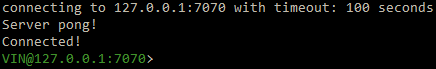

**************************************
VIN™ Command Line Interface (CLI)
**************************************

The VIN™ CLI acts as a Hypertext Transfer Protocol (HTTP) client for reaching the VIN™ HTTP server from the command line in a Linux environment. It will be installed during the installation of the VIN™.

The following table displays a list of commands that are accessible by the VIN™ CLI. For examples and the results of each command, please refer to the :ref:`vincli-func` section.

.. _supported-commands:

.. csv-table:: VIN™ CLI Supported Commands
    :header: Command, Command Line Instruction, Description
    :widths: 15 40 50 

    Help, help, "Displays a list of commands available to the VIN™ CLI."
    Ping, ping, "Pings the connected node to check its status. The connected node responds with a 'Server pong!' message if successful."
    GetPeers, getPeers, "Get the IP addresses and node ports for all nodes connected on this network. Note: some of the nodes may be stale."
    Put, put <key> <value>, "Puts a user provided value (string) onto the network which corresponds to the user provided key (string)."
    Get, get <key>, "Requires a given key (string) and returns the Key-Value pair from the respective node. The value is displayed in the CLI window. No other output is displayed."
    Spread, spread <filepath>, "Splits a file of any type located in a given filepath (string) into tokens and then spreads them across the network. An encrypted cryptographic receipt is then generated and stored in ``/opt/VIN/receipts/sent`` in Linux and ``VIN\receipts\sent\`` in Windows."
    Gather, gather <receipt_filepath>, "Gathers a spread file using the given receipt_filepath (string). It will be reassembled as a new file into the output directory ``/opt/VIN/outputs`` in Linux and ``VIN\outputs\`` in Windows."
    Gather, gather <command> <receipt_filepath>, "Gathers a file but enables control over how the file is stored after gathered. The commands available are:'append', '-a', 'a' to append data to existing file; 'overwrite', '-o', 'o' to overwrite the existing file; 'create', '-c', 'c' to create a new file." 
    Share, share <filepath> <ip_address> <receipt_port>, "The peer spreads a file from a given filepath (string), automatically establishs a secure channel with the ip_address (string) and receipt port (string) of another peer in the network, and transfers the encrypted cryptographic receipt. The receiver peer will automatically call ``gather`` on the receipt once decrypted."
    Share, share <command> <filepath> <ip_address> <receipt_port>, "Performs a spread but enables control over how the file is stored after gathered. The commands available are:'append', '-a', 'a' to append data to existing file; 'overwrite', '-o', 'o' to overwrite the existing file; 'create', '-c', 'c' to create a new file." 
    Share, share <command> <filepath> <ip_address> <receipt_port> <runs>, "Performs a spread, enables control over how the file is stored and specifies the number of runs (string) to attempt to successfully spread the file."
    Shutdown, shutdown, "Send a shutdown signal to the current node that the user is connected to."
    Exit, exit, "Quits the current session of the VIN™ CLI."

Flags to control the functionality of the VIN_CLI commands are listed in the folloiwng table:

.. This information came from C:\Dev\qtoken-cpp\apps\helper.cpp 

.. csv-table:: VIN™ CLI Flags
    :header: Flag Name, Command Line Instruction, Description
    :widths: 20 10 70 

    List Flag, -l, ``NEED INFORMATION``
    Bootstrap Flag, -b, "Indicates that the node being instantiated will be a bootstrap node."
    Node Flag, -n, "Indicates that the node being instantiated will be a peer node."
    Configuration Directory Flag, -c, ``NEED INFORMATION``
    Bootstrap IP Flag, -a, "This flag specifies that the next string will be the boostrap node's IP address which the peer will connect to."
    Bootstrap Port Flag, -s, ``NEED INFORMATION``
    Kademlia Port Flag, -p, "This flag specifies that the next string will be the Kademlia port through which the node will communicate bi-directionally with the Kademlia network."
    Receipt Port Flag, -r, "This flag specifies that the next string will be the port through which the node will receive its cryptographic receipts."
    HTTP Port Flag, -h, "This flag specifies that the next string will be the port utilized for HTTP messages by the node."
    LVM Port Flag, -v, "This flag specifies that the next string will be the port through which the node communicates with the LVM."

.. _run-vin:

Instantiating the VIN™ and VIN CLI
====================================

To run a simple VIN™ on a local machine, a minimum of three VIN™ nodes, one bootstrap node and two sender/receiver nodes, must be instantiated. To do so, the following steps should be completed:

* Open four terminal sessions in the directory where the VIN™ executable resides. Note: if the VIN™ was installed correctly, VIN™ nodes can be launced from any directory. Just remove the ``./`` for Linux or ``.\`` for Windows from the commmand.
* In one of the sessions, run ``./VIN -b 127.0.0.1`` for Linux or ``.\VIN -app -b 127.0.0.1`` for Windows. This will serve as the bootstrap node and will occupy port 8000 for incoming connections.
* On another session, run ``./VIN -app -n -a 127.0.0.1 -h 7080 -p 8080 -r 9090`` for Linux or ``.\VIN -app -n -a 127.0.0.1 -h 7080 -p 8080 -r 9090`` for Windows. This will start a VIN™ peer node with an HTTP port of 7080, a data (Kademlia) port of (8080) and a receipt server port of 9090. These ports can be chosen based on the requirements/restrictions of the user.
* On the third terminal window, run ``./VIN -n -a 127.0.0.1 -h 7071 -p 8081 -r 9091`` for Linux or ``.\VIN -app -n -a 127.0.0.1 -h 7071 -p 8081 -r 9091`` for Windows. Note that the HTTP, data and receipt ports are different than the node which was first instiated.
* On the final terminal window, run ``./VIN_CLI 127.0.0.1 7080`` for Linux or ``.\VIN_CLI 127.0.0.1 7080`` for Windows. This will launch the VIN_CLI if the above steps were completed successfully. If everything is working correctly, the terminal should contain the following:

  Successful VIN_CLI Connection

To run a VIN™ on an IP based network, such as Amazon Web Service (AWS), a Local Area Network (LAN) with routers/switches and Dynamic Host Communication Protocol (DHCP), VMware, etc., start by running a bootstrap node using the IP address of the node's system. Record this IP address and use it in place of the local address, ``127.0.0.1`` listed in the above instructions, when instantiating the other nodes in the network. 

.. _vincli-func:

VIN CLI Functionality
=====================

Putting a Value onto the Network
--------------------------------
A simple way to ensure that the network as been properly configured is to put a key-value pair onto the network. To do so, in the VIN_CLI window, run ``put <key> <value>``. For this example ``test_key`` was used for the ``<key>`` and ``test_value`` for the ``<value>``. Note that the ``<key>`` and ``<vaule>`` can be any string that doesn't contain spaces. The figure below is the result of the successful ``put``.

.. figure:: images/vin_cli/vincli_put.png
  :width: 400
  :align: center
  :alt: Succesful Put

  Successful Put

Getting a Value from the Network
--------------------------------
With the value on the network it can be retrieved by running ``get <key>``. For this example ``test_key`` was used for the ``<key>``. The figure below is the result of the successful ``get``.

.. figure:: images/vin_cli/vincli_get.png
  :width: 500
  :align: center
  :alt: Succesful Get

  Successful Get

.. _spread-file:

Spreading a File
----------------
The VIN can spread any file type onto it's network. To do a basic spread run ``spread <filepath>`` where the ``<filepath>`` is the asolute path and name of the file to be spread. For this example it is ``/home/user/Dev/test/vin_test.txt``. An encrypted cryptographic receipt is generated upon spreading, is outputted in the terminal window, and is stored in ``/opt/VIN/receipts/sent`` and ``VIN\receipts\sent\`` directories in Linux and Windows, respectively. The output of a successful ``spread`` is shown below.

.. figure:: images/vin_cli/vincli_spread.png
  :width: 500
  :align: center
  :alt: Succesful Spread

  Successful Spread

Gathering a File
----------------
After a file as been spread to the network a cryptographic receipt will be generated. Using this receipt, the file can be retrieved from the network via the ``gather`` command. To do a basic ``gather``, run ``gather <receipt_path>``. Copy the ``<receipt_path>`` generated from the :ref:`spread-file` example; in this case, it was ``/opt/VIN/receipts/sent/CR899957170``. If the file was successfully gathered, the following oputout should be displayed.

.. figure:: images/vin_cli/vincli_gather.png
  :width: 600
  :align: center
  :alt: Succesful Gather

  Successful Gather

Note: this ``gather`` created a new ``vin_test.txt`` file, thus there is a ``(2)`` at the end of the filename. To overwrite the file, or append to its contents, refer to the :ref:`supported-commands` table.

Sharing a File
--------------
The VIN™ is capable of sharing any file type that is required by the user. To do a basic share run ``share <filepath> <ip_address> <receipt_port>``. For this example, ``<filepath>`` is ``/home/user/Dev/test/vin_test.txt``, the ``<ip_address>`` and ``<receipt_ports>`` are the IP address and receipt port of the VIN™ node not being utlized by the VIN_CLI, or ``127.0.0.1`` and ``9091``, respectively. Completing a succesful share will generate the following output:

.. figure:: images/vin_cli/vincli_share.png
  :width: 700
  :align: center
  :alt: Succesful Share

  Successful Share

To manually confirm that the file has been received navigate to ``/opt/VIN/outputs/`` for Linux and ``C:\ProgramData\VIN\outputs`` for Windows and ensure that the file is located in this directory. Additionally, ``/opt/VIN/receipts/sent/`` for Linux and ``C:\ProgramData\VIN\receipts\sent`` for Windows should contain a new cryptographic receipt.

For all of the options available with the ``share`` command, refer to the :ref:`supported-commands` table.

Shutting Down a Node
-----------------------

To shutdown the particular node which the *VIN CLI* is currently connected to, run ``shutdown``.

