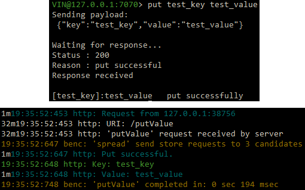
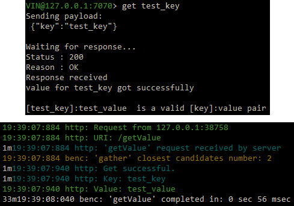

**************************************
VIN™ Command Line Interface (CLI)
**************************************

The VIN™ CLI acts as a Hypertext Transfer Protocol (HTTP) client for reaching the *VIN™* HTTP server from the command line in a *Linux* environment. It will be installed during the installation of the *VIN™*.

The following table displays a list of commands that are accessible by the *VIN™ CLI*. For examples and the results of each command, please refer to the :ref:`vincli-func` section.

.. _supported-commands:

.. csv-table:: VIN™ CLI Supported Commands
    :header: Command, Command Line Instruction, Description
    :widths: 15 40 50 

    Help, help, "Displays a list of commands available to the *VIN™ CLI*."
    Ping, ping, "Pings the connected node to check its status. The connected node responds with a 'Server pong!' message if successful."
    GetPeers, getPeers, "Get the IP addresses and data ports for all nodes connected on this network. Note: some of the nodes may be stale."
    Put, put <key> <value>, "Puts a user provided value (string) onto the network which corresponds to the user provided key (string)."
    Get, get <key>, "Requires a given key (string) and returns the Key-Value pair from the respective node. The value is displayed in the *VIN™ CLI* window. No other output is displayed."
    Spread, spread <filepath>, "Splits a file of any type located in a given filepath (string) into tokens and then spreads them across the network. An encrypted cryptographic receipt is then generated and stored in ``/opt/VIN/receipts/sent`` in *Linux* and ``VIN\receipts\sent\`` in *Windows*."
    Gather, gather <receipt_filepath>, "Gathers a spread file using the given receipt_filepath (string). It will be reassembled as a new file into the output directory ``/opt/VIN/outputs`` in *Linux* and ``VIN\outputs\`` in *Windows*."
    Gather, gather <command> <receipt_filepath>, "Gathers a file but enables control over how the file is stored after gathered. The commands available are: ``append``, ``-a``, ``a`` to append data to existing file; ``overwrite``, ``-o``, ``o`` to overwrite the existing file; ``create``, ``-c``, ``c`` to create a new file." 
    Share, share <filepath> <ip_address> <receipt_port>, "The peer spreads a file from a given filepath (string), automatically establishes a secure channel with the ip_address (string) and receipt port (string) of another peer in the network, and transfers the encrypted cryptographic receipt. The receiver peer will automatically call ``gather`` on the receipt once decrypted."
    Share, share <command> <filepath> <ip_address> <receipt_port>, "Performs a spread but enables control over how the file is stored after gathered. The commands available are: ``append``, ``-a``, ``a`` to append data to existing file; ``overwrite``, ``-o``, ``o`` to overwrite the existing file; ``create``, ``-c``, ``c`` to create a new file." 
    Share, share <command> <filepath> <ip_address> <receipt_port> <runs>, "Performs a spread, enables control over how the file is stored and specifies the number of runs (string) to attempt to successfully spread the file."
    Shutdown, shutdown, "Send a shutdown signal to the current node that the user is connected to."
    Exit, exit, "Quits the current session of the *VIN™ CLI*."
    Download, download <file_path> <save_path>, "Download file from provided <file_path> absolute path to crypto receipt file. File saved at given path <save_path>."
    Update FUSE Peer, update_peer <ip_add_rec> <recp_port_rec> <folder_path>, "Add a receiver peer via its IP address, receipt port, to a fuse folder path."
    Health Check, health_check, "Displays health information for the node."
    Receipt Validation, receipt_validation <file_path>, "Validates a cryptographic receipt at the given file path (including receipt name)."

.. _vincli-func:

VIN™ CLI Functionality
===========================

The following instructions assume that a *VIN™* has been instantiated and that at least one instance of the *VIN™ CLI* is running. For more information on how to get these working, refer to :doc:`getting_started_with_vin`.

Putting a Value onto the Network
--------------------------------
A simple way to ensure that the network as been properly configured is to put a key-value pair onto the network. To do so, in the *VIN™ CLI* window, run ``put <key> <value>``. For this example ``test_key`` was used for the ``<key>`` and ``test_value`` for the ``<value>``. Note that the ``<key>`` and ``<value>`` can be any string that doesn't contain spaces. The figure below is the result of the successful ``put``.

  Successful Put (*VIN™ CLI* = top, Peer_1 = bottom)

Getting a Value from the Network
--------------------------------
With the value on the network it can be retrieved by running ``get <key>``. For this example ``test_key`` was used for the ``<key>``. The figure below is the result of the successful ``get``.

  Successful Get (*VIN™ CLI* = top, Peer_1 = bottom)

.. _spread-file:

Spreading a File
----------------
The *VIN™* can spread any file type onto it's network. To do a basic spread run ``spread <filepath>`` where the ``<filepath>`` is the absolute path and name of the file to be spread. For this example, it is ``/home/user/Dev/test/vin_test.txt``. An encrypted cryptographic receipt is generated upon spreading, is outputted in the terminal window, and is stored in ``/opt/VIN/receipts/sent`` and ``VIN\receipts\sent\`` directories in *Linux* and *Windows*, respectively. The output of a successful ``spread`` is shown below.

  Successful Get (*VIN™ CLI* = top, Peer_1 = bottom)

Gathering a File
----------------
After a file as been spread to the network a cryptographic receipt will be generated. Using this receipt, the file can be retrieved from the network via the ``gather`` command. To do a basic ``gather``, run ``gather <receipt_path>``. Copy the ``<receipt_path>`` generated from the :ref:`spread-file` example; in this case, it was ``/opt/VIN/receipts/sent/CR899957170``. If the file was successfully gathered, the following output should be displayed.

.. figure:: images/vin_cli/vincli_gather.png
  :scale: 100
  :align: center
  :alt: Successful Gather

  Successful Get (*VIN™ CLI* = top, Peer_1 = bottom)

Note: this ``gather`` created a new ``vin_test.txt`` file, thus there is a ``(2)`` at the end of the filename. To overwrite the file, or append to its contents, refer to the :ref:`supported-commands` table.

Sharing a File
--------------
The *VIN™* is capable of sharing any file type that is required by the user. To do a basic share run ``share <filepath> <ip_address> <receipt_port>``. For this example, ``<filepath>`` is ``/home/user/Dev/test/vin_test.txt``, the ``<ip_address>`` and ``<receipt_port>`` are the IP address and receipt port of the *VIN™* node not being utilized by the *VIN™ CLI*, or ``127.0.0.1`` and ``9091``, respectively. Completing a successful share will generate the following output:

  Successful Share Between Peers (*VIN™ CLI* = top, Peer_1 = left, Peer_2 = right)

To manually confirm that the file has been received navigate to ``/opt/VIN/outputs/`` for *Linux* and ``C:\ProgramData\VIN\outputs`` for *Windows* and ensure that the file is located in this directory. Additionally, ``/opt/VIN/receipts/sent/`` for *Linux* and ``C:\ProgramData\VIN\receipts\sent`` for *Windows* should contain a new cryptographic receipt.

For all of the options available with the ``share`` command, refer to the :ref:`supported-commands` table.

Getting Peers Connected to the Bootstrap
----------------------------------------

Run ``getPeers`` in the *VIN™ CLI* window to generate a list of all peers connected to a bootstrap node as displayed in the figure below.  

  getPeers Example

In this example, there are two peers with their information listed as follows: ``[unique_node_identifier: { ip_address_of_peers_host peers_data_port }]``

Shutting Down a Node
-----------------------

To shutdown the particular node which the *VIN™ CLI* is currently connected to, run ``shutdown``.

  Successful Shutdown (*VIN™ CLI* = top, Peer_1 = bottom)