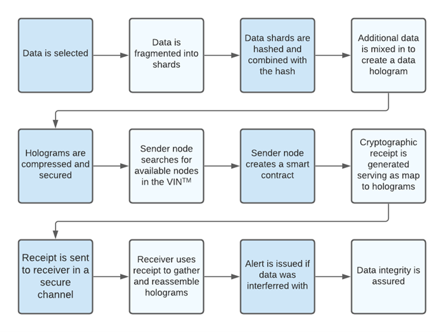
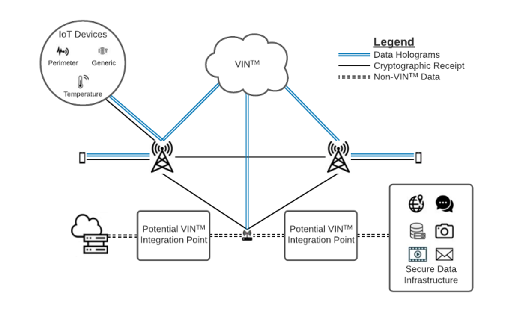

******************
VIN™ Description
******************

Introduction
============

Data integrity at rest and in transmission, while being subjugated to unintentional human error, natural disasters, and D5 effects (deny, deceive, degrade, disrupt, and destroy) is critical in the modern world. Whether calculated malicious attacks or unintended behaviors are the culprit, data assurance has never been more important. While solutions to these issues exist, they rely on trusted devices and techniques resulting in these methods and technology approaches being very expensive to implement and operate. Additionally, they are easily attacked and compromised. Having the capability of assured data transmission on user systems, devices, and enterprise systems would allow for the sharing of approved files, software, and applications. From the operational and strategic perspective, there is a significant need to ensure that data integrity is assured when data is being uploaded to or transmitted from mission critical systems and data repositories.

Data Integrity
==============

A solution that addresses the data integrity challenge has to deliver extreme confidentiality, integrity, and availability. It must therefore satisfy a range of complex, interlocking requirements. Without being overly difficult to operate, it must ensure absolute integrity for data in transit or motion (messages), data at rest (storage) and software programs. 

To achieve these goals, the solution must:

* Be anti-fragile and resistant to cyberattacks like ransomware
* Deliver immutable and auditable verification of data, files, and software 
* Provide alerts and proof of data integrity
* Seamlessly deploy onsite, as well as on user systems and endpoints
* Ensure that stakeholder’s files and software maintain integrity throughout their full respective lifecycle
* Provide real-time audits of software changes with alerts when software integrity/data assurance may have been breached.
* Prevent compromised data, files, and software from being executed on any user system, e.g., mobile, desktop or cloud

Administratively, the solution needs powerful capabilities that are simple and easy to manage. This is critical in high stress environments where users do not have the luxury to spend time on fussy system management issues. For example, the solution must have the flexibility for approved software updates/upgrades to be performed post-software delivery (e.g., patches and new functionality), both onsite and remotely. That way, everyone can be confident in verification of approved software updates.

If the solution can meet these criteria, Command, Control and Communications are expected. Quality of Service (QoS) and Quality of Data are similarly expected, as are operational mission agility and continuity. Decision makers can be confident that their mission decisions and operations are based on accurate data and communications.

The Virgil Integrity Network™ (VIN™)
=======================================

The Virgil Integrity Network™ is a network agnostic middleware solution for assured integrity and availability of data in adverse environments. The VIN™ guarantees 100% data integrity and availability, across all network types, in the end-to-end digital supply chain and operational continuity through adverse and adversarial environments even with 80%+ data impact during D5 attacks (delay, disrupt, degrade, destroy, and deceive).  

The patented technology leverages techniques from Digital Ledgers, quantum computing, advanced cryptography, graph-based networking, and Artificial Intelligence (AI) to provide unparalleled data integrity not just for communications, but as well for data storage. The negligible latency impact, the speed of encoding and decoding provides real-time data transmission not only for static content (files) but as well for streaming (media) as well. The use of digital ledgers within the VIN™’s digital supply chain ensures that data and transaction provenance assurance take place and that data is authentic and tamper-proof.

VIN™ Core Values
==================

Confidentiality
---------------

The VIN™ ensures data security against the strongest types of attacks by sharding and encrypting. Data is safeguarded even in untrusted (public) networks and domains. Security travels with the data, and only authorized users can access or modify it even if the underlying infrastructure is compromised. 

Integrity
---------

Our breakthroughs in error correction, with the ability to restore integrity and maintain an immutable transaction ledger in the face of more than 80% errors or corruption ensures customers and operators can trust data is secure. 

Availability
------------

The combination of error correction with distributed storage in multiple public or private clouds allows the data to be available and restored despite catastrophic outages in 3rd party infrastructure.  

Policy & Audit 
--------------

The VIN™ is the first distributed ledger built for communications. Data and transactions are stored in an immutable auditable ledger. All data is traceable on a supply chain that ensures trust and reliability for critical operations.

Operational Capabilities
------------------------

The VIN™, as part of its guarantee of data integrity and availability, provides the following operational capabilities: 

* Zero-Trust Networking

  * Virgil applies distributed ledgers as communications middleware with patented encoding techniques 
  * Invulnerable Storage – obfuscation and random mixing 
  * Invulnerable Communications: integrity/availability guarantee 
  * Network visibility 

* Multi-cloud – avoid vendor dependency, lock-in, risk 
* Data transaction logs for monitoring and compliance 
* Ensure data provenance and access control 
* Withstand large-scale network damage 
* Lightweight installation footprint  
* Negligible latency impact 
* Speed of encoding and decoding provides real-time data transmission 
* Digital ledgers within the VINTMs digital supply chain ensures that data and transaction provenance assurance occur and that data is authentic and tamper-proof 
* Network agnostic 
* Supports both static files and streaming media 

Data Flow in the VIN™
=======================

To demonstrate how the VIN™ works imagine a sender wishing to transmit some important data to a receiver. The sender’s node seamlessly and nearly instantly transforms the outgoing data using patented error-correcting codes. The data is spread out over a network of nodes in a privacy preserving way that is indistinguishable from noise. Only an authorized receiving node can gather the data back together. A detailed step-by-step process is listed below:

* The sender selects the data that is to be sent. 
* The data is fragmented into shards which will be transformed into a tokenized hologram (qToken).
* Data shards are hashed, and each shard is combined with its hash.
* Additional data is mixed in creating a data hologram.
* These holograms are then compressed and secured.
* The sender node searches the network for available hosts
* It creates a smart contract consisting of the order of randomly distributed tokenized holograms.
* A cryptographic receipt is generated serving as map for receiver to find and reassemble tokenized holograms and is transmitted through a specially secured channel.
* The receiver utilizes the cryptographic receipt to gather and reassemble the scattered tokenized holograms.
* An alert is issued if there is interference with the data in transit. 
* Data integrity and availability is assured even if up to 80% of data is destroyed or delayed during transmission.

  
  VIN™ Data Flow

  
  High-Level Description of the VIN™
 

The security of the end-to-end data supply chain is assured by a proprietary Proof of Integrity. Both the receiver and the sender are assured that the data was received in integrity, even if 80% of the data is affected by attackers, degradation, or network outages. An operator is alerted of any attempted interference even across physical and logical networks.
